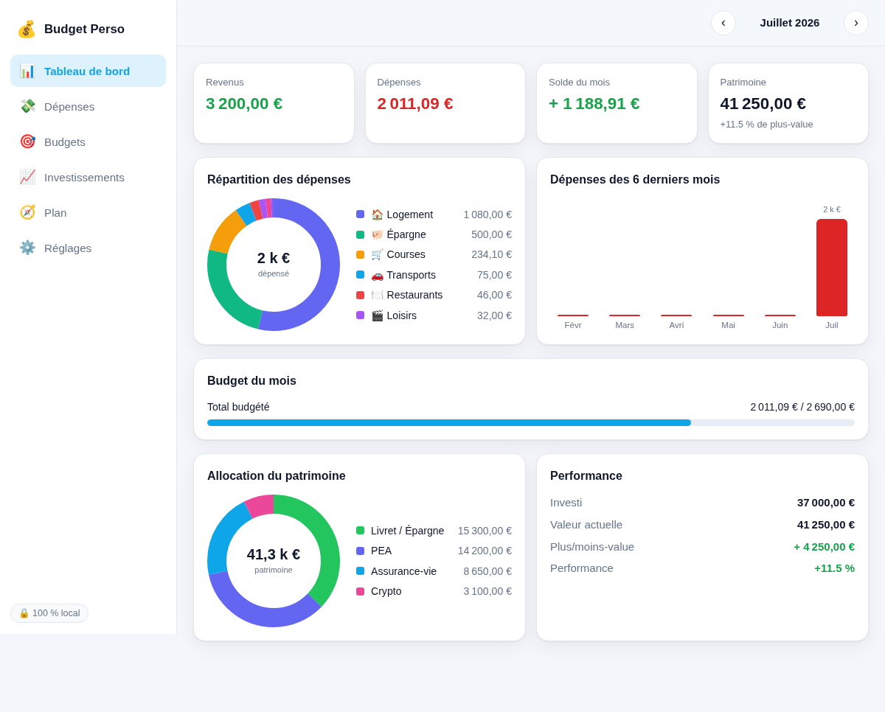
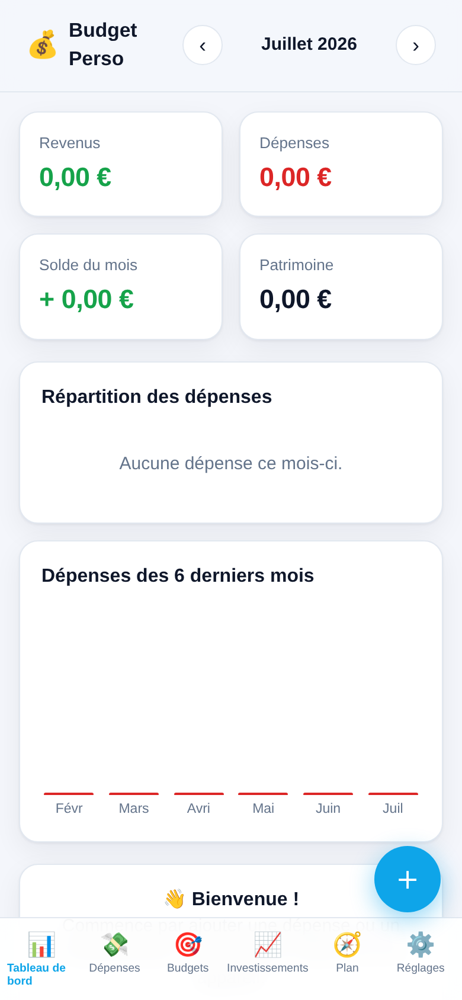
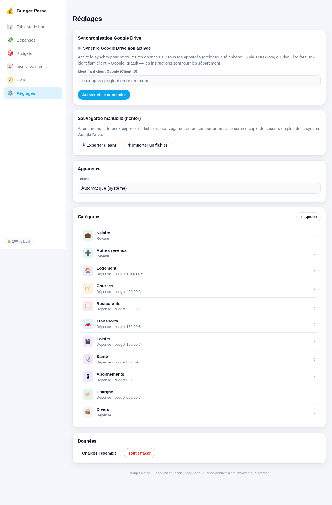
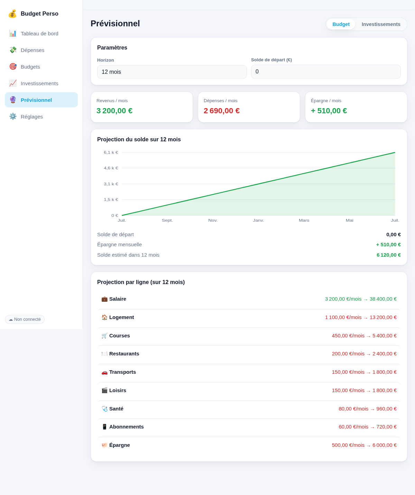

# Budget Perso — Documentation technique & fonctionnelle

**Application web de gestion de budget personnel, de dépenses et d'investissements.**

| | |
|---|---|
| **Nom du projet** | Budget Perso |
| **Type** | Application web progressive (PWA) |
| **Adresse** | `https://gregory-at-choice.github.io/budget-perso/` |
| **Technologies** | HTML, CSS, JavaScript (sans framework, sans outil de compilation) |
| **Stockage** | Local (navigateur) + synchronisation Google Drive |
| **Hébergement** | GitHub Pages (gratuit) |
| **Licence des données** | 100 % privées, jamais envoyées à un serveur tiers |

---

## Résumé exécutif

**Budget Perso** est une petite application que l'on ouvre dans un navigateur — sur ordinateur comme sur téléphone — pour **suivre ses dépenses**, **définir des budgets** par catégorie, **piloter ses placements** et **projeter l'avenir** (solde futur, patrimoine avec intérêts) grâce à des courbes.

Trois partis pris la caractérisent :

1. **Simplicité maximale.** Aucun « framework » à la mode, aucune étape de compilation : juste les trois langages natifs du web (HTML, CSS, JavaScript). Résultat : le code est lisible, durable, et fonctionne partout sans installation.
2. **Confidentialité d'abord (« local-first »).** Les données vivent dans le navigateur de l'utilisateur et, s'il le souhaite, dans **son propre** Google Drive. Elles ne transitent par **aucun** serveur intermédiaire.
3. **Accessible partout, gratuitement.** Installable comme une vraie application (sur le Mac, sur l'iPhone), fonctionnant même hors-ligne, hébergée gratuitement.

Ce document décrit **la méthode** qui a présidé à sa conception, **l'architecture** technique retenue, puis **le code** lui-même. Il se termine par une **annexe exhaustive** reproduisant l'intégralité du code source, chaque fichier étant remis en perspective avec l'architecture.

---

## 0. Comment lire ce document

Ce document s'adresse à **deux publics à la fois** :

- une personne **novice** en informatique, qui veut comprendre *ce que fait* l'application et *comment elle est construite*, sans prérequis ;
- une personne **spécialiste**, qui cherche les détails d'implémentation, les choix d'architecture et le code complet.

Pour concilier les deux, on utilise deux types d'encadrés :

> 🔰 **Pour les novices** — une explication imagée d'un concept technique, sans jargon.

> 🧠 **Note technique** — une précision destinée aux développeurs.

Un **glossaire** en fin de document (section 8) définit tous les termes techniques employés. Les mots qui y figurent sont signalés la première fois par une astérisque, par exemple : *PWA\**.

---

## 1. Vue d'ensemble

### 1.1 À quoi sert l'application ?

Budget Perso réunit, en un seul endroit, deux besoins de la vie financière courante :

1. **La gestion courante** — combien j'ai gagné, combien j'ai dépensé, dans quelles catégories, et suis-je dans les clous de mes budgets ?
2. **La constitution d'un patrimoine** — où en sont mes placements (livret, PEA, assurance-vie, actions, crypto, immobilier…), et combien vaudront-ils dans le futur avec les intérêts ?

Elle est organisée en **sept écrans** (appelés « vues ») :

| Écran | Rôle |
|---|---|
| **Tableau de bord** | Synthèse du mois : revenus, dépenses, solde, répartition, patrimoine, performance. |
| **Dépenses** | Saisie et liste des opérations (dépenses et revenus), avec les **opérations récurrentes** (loyer, salaire…). |
| **Budgets** | Un budget mensuel par catégorie, avec suivi de consommation et **report du reliquat** d'un mois sur l'autre. |
| **Investissements** | Le portefeuille : chaque placement, sa valeur, sa plus/moins-value, l'allocation globale. |
| **Prévisionnel** | Des **courbes** de projection : le solde futur (côté budget) et le patrimoine futur avec intérêts (côté investissements). |
| **Réglages** | Synchronisation Google Drive, sauvegarde par fichier, thème, gestion des catégories. |



*Le tableau de bord : cartes de synthèse, répartition des dépenses en anneau, tendance sur six mois, allocation du patrimoine et performance.*

### 1.2 Ce qui la distingue

- **Aucune dépendance externe.** Les graphiques (anneaux, barres, courbes) sont dessinés « à la main » en SVG\*. Il n'y a ni bibliothèque de graphes, ni jQuery, ni React. Cela garantit qu'elle fonctionne hors-ligne et ne vieillira pas au rythme des modes.
- **« Local-first ».** L'application fonctionne intégralement sans connexion. La synchronisation Google Drive est une **option** qui vient se greffer par-dessus.
- **Installable (PWA\*).** On peut l'« installer » sur l'écran d'accueil du téléphone ou dans le dock du Mac : elle s'ouvre alors en plein écran, comme une application native.



*Sur téléphone : barre de navigation en bas, bouton d'ajout flottant, cartes adaptées à l'écran.*

---

## 2. Méthodologie

Cette section décrit **la démarche** de conception : les questions posées, les décisions prises, et *pourquoi*. C'est le « making-of » du projet.

### 2.1 Le besoin de départ

Le point de départ était une question simple :

> « Je veux un outil pour suivre et planifier mes dépenses perso, mais aussi placer mon argent et planifier mes investissements. Accessible sur ordinateur **et** sur téléphone. »

De cette phrase découlent trois exigences implicites :

1. **Multi-plateforme** — ça doit marcher sur un ordinateur (quel que soit le système) **et** sur un téléphone.
2. **Deux domaines** — le budget du quotidien **et** les investissements.
3. **Personnel** — c'est un outil privé, pas un logiciel d'entreprise.

### 2.2 Première décision : quel *type* d'application ?

Trois grandes familles étaient possibles :

| Option | Avantages | Inconvénients |
|---|---|---|
| **Application native iOS** | Intégration parfaite à l'iPhone | Ne marche **pas** sur ordinateur Windows/Linux ni sur Android ; nécessite un Mac + Xcode pour compiler ; passage par l'App Store |
| **Application native multi-plateforme** (Flutter…) | Vraies applis iOS/Android/desktop | Lourde à mettre en place ; nécessite un environnement de compilation |
| **Application web (PWA\*)** | Marche dans **n'importe quel navigateur**, sur **tout appareil** ; un seul code ; installable ; hébergement gratuit | Quelques limites d'accès au matériel (peu gênantes ici) |

> 🔰 **Pour les novices** — Une **application web** est un site internet qui se comporte comme une application. Une **PWA** (« Progressive Web App ») est une application web à laquelle on ajoute deux ingrédients qui la rendent « installable » et utilisable **hors-ligne** : un *manifeste* (sa carte d'identité) et un *service worker* (un petit programme qui garde l'application en mémoire). On y reviendra.

**Décision : une PWA.** C'est la seule option qui coche « ordinateur ET téléphone » avec un seul code, sans coût, sans compilation, et sans dépendre d'un magasin d'applications. Le nom du dépôt de code, `web-choice`, reflète d'ailleurs ce choix.

### 2.3 Deuxième décision : où vivent les données ?

Pour un outil **financier et personnel**, la question du stockage est centrale. Deux approches :

- **« Local-first »** — les données restent sur l'appareil (dans le navigateur). Avantages : privé, gratuit, instantané, hors-ligne. Inconvénient : par défaut, les données ne « voyagent » pas d'un appareil à l'autre.
- **Synchronisation cloud** — les données sont stockées sur un serveur pour être accessibles partout. Avantage : confort. Inconvénient : il faut un serveur, un compte, et héberger des données sensibles quelque part.

**Décision, en deux temps :**

1. Démarrer **local-first**, avec un simple **export/import** d'un fichier de sauvegarde. Rapide à construire, parfaitement privé.
2. Puis, à la demande, ajouter une **synchronisation via Google Drive** : les données sont enregistrées dans un fichier `budget-perso.json` situé dans le **Drive de l'utilisateur lui-même**. Elles restent donc privées (protégées par son compte Google) tout en devenant accessibles depuis n'importe quel appareil.

> 🧠 **Note technique** — La synchro utilise l'autorisation Google `drive.file`, la plus restrictive : l'application ne peut lire/écrire **que le fichier qu'elle a elle-même créé**, jamais le reste du Drive. Le cœur « local-first » demeure : `localStorage` sert de cache et de source de vérité hors-ligne ; Drive n'est qu'une couche de synchronisation par-dessus.

### 2.4 Troisième décision : quelle *stack* technique ?

Le choix a été de n'utiliser **que les langages natifs du web**, sans framework ni « build » :

- **HTML** pour la structure,
- **CSS** pour l'apparence,
- **JavaScript** (en modules ES\*) pour la logique.

> 🔰 **Pour les novices** — Un **framework** (React, Vue, Angular…) est une grosse boîte à outils qui aide à construire des interfaces, mais qu'il faut apprendre, mettre à jour, et souvent « compiler ». Un **outil de compilation** (ou « build ») transforme le code écrit par le développeur en code optimisé pour le navigateur. **Ici, rien de tout ça** : le navigateur lit directement les fichiers écrits. C'est plus simple, plus durable, et hébergeable gratuitement n'importe où.

**Pourquoi ce choix, alors que les frameworks dominent ?**

- **Pérennité** — sans dépendances, le code ne « pourrit » pas quand les bibliothèques changent. Il fonctionnera encore dans dix ans.
- **Transparence** — tout est lisible, il n'y a pas de « magie » cachée. Idéal pour un document pédagogique comme celui-ci.
- **Poids plume** — l'application entière pèse quelques dizaines de kilo-octets. Elle se charge instantanément et se met en cache facilement.
- **Zéro friction de déploiement** — pas de compilation = on peut l'héberger sur un simple serveur de fichiers (GitHub Pages).

### 2.5 La démarche de construction : itérative

L'application n'a pas été conçue d'un bloc, mais **par itérations successives**, chacune apportant une brique fonctionnelle testée et déployée avant de passer à la suivante :

1. **Socle** — les six vues, le modèle de données, les graphiques, le stockage local, l'export/import, la PWA.
2. **Mise en ligne** — dépôt public dédié + activation de GitHub Pages.
3. **Synchronisation Google Drive** — connexion, lecture/écriture du fichier, fusion des données.
4. **Robustesse de la connexion** — rafraîchissement automatique du jeton, reconnexion silencieuse, synchro bidirectionnelle.
5. **Opérations récurrentes** — génération automatique du loyer, du salaire, des abonnements.
6. **Prévisionnel** — courbes de projection du budget et du patrimoine.
7. **Budgets « enveloppe »** — report du reliquat non dépensé d'un mois sur l'autre.
8. **Finitions** — rendement à deux décimales, formats français, etc.

> 🧠 **Note technique** — Chaque itération a suivi le même cycle : *écrire → vérifier → déployer → ajuster*. La vérification s'appuyait sur un **navigateur sans interface** (Chromium piloté par Playwright) pour charger l'application, simuler des interactions, capturer des captures d'écran et détecter les erreurs JavaScript ; ainsi que sur des **tests unitaires** de la logique sensible (calcul du report, génération des récurrences, projections). Le déploiement se faisait par **Git** vers GitHub, GitHub Pages reconstruisant automatiquement le site.

### 2.6 Principes directeurs (résumé)

| Principe | Traduction concrète |
|---|---|
| **Local-first** | `localStorage` est la source de vérité ; la synchro est optionnelle. |
| **Confidentialité** | Aucune donnée sur un serveur ; autorisation Google minimale (`drive.file`). |
| **Gratuité** | Hébergement GitHub Pages ; API Google en quota gratuit ; données dans le Drive de chacun. |
| **Zéro dépendance** | Graphiques SVG maison, pas de framework, pas de CDN. |
| **Offline-first** | Service worker : l'application marche sans réseau. |
| **Accessibilité** | Responsive (ordinateur + mobile), thème clair/sombre, formats € / fr-FR. |

---

## 3. Architecture

Cette section décrit **comment l'application est construite** : ses grandes pièces, la façon dont elles communiquent, et le chemin que suivent les données.

### 3.1 Vue d'ensemble

L'application se décompose en **fichiers**, chacun ayant une responsabilité claire :

```
budget-perso/
├── index.html            → la « coquille » : structure de la page + navigation
├── styles.css            → toute l'apparence (couleurs, mise en page, responsive, thèmes)
├── manifest.webmanifest  → carte d'identité PWA (nom, icônes, couleurs) → installation
├── sw.js                 → service worker : cache pour le fonctionnement hors-ligne
├── js/
│   ├── config.js         → configuration (identifiant Google)
│   ├── store.js          → LES DONNÉES : modèle, stockage, logique métier
│   ├── ui.js             → OUTILS : formatage (€, dates) + graphiques SVG
│   ├── drive.js          → SYNCHRO : connexion et échanges avec Google Drive
│   └── app.js            → L'ORCHESTRATEUR : navigation, écrans, formulaires
└── icons/                → icônes de l'application (SVG + PNG)
```

> 🔰 **Pour les novices** — On peut voir l'application comme un **restaurant** :
> - `index.html` est la **salle** (les murs, les tables) ;
> - `styles.css` est la **décoration** (couleurs, ambiance) ;
> - `store.js` est la **cuisine et le garde-manger** (les ingrédients — vos données — et les recettes — les calculs) ;
> - `ui.js` est la **batterie d'ustensiles** (les outils réutilisables) ;
> - `drive.js` est le **service de livraison** (qui va chercher/déposer vos données dans votre coffre Google Drive) ;
> - `app.js` est le **chef d'orchestre** (il décide quoi afficher, réagit à vos clics) ;
> - `sw.js` + `manifest` transforment le restaurant en **food-truck** : on peut l'emporter partout et il fonctionne même sans réseau.

### 3.2 Le schéma des couches

```
        ┌───────────────────────────────────────────────────────────┐
        │                     UTILISATEUR (clics)                    │
        └───────────────────────────┬───────────────────────────────┘
                                     ▼
        ┌───────────────────────────────────────────────────────────┐
        │  PRÉSENTATION                                              │
        │  index.html  +  styles.css  +  app.js (vues & formulaires) │
        └───────────────┬───────────────────────────┬───────────────┘
                        │ lit / écrit               │ utilise
                        ▼                           ▼
        ┌───────────────────────────┐   ┌───────────────────────────┐
        │  ÉTAT & LOGIQUE           │   │  UTILITAIRES              │
        │  store.js                 │   │  ui.js                    │
        │  (données, budgets,       │   │  (formatage €/dates,      │
        │   récurrences, calculs)   │   │   graphiques SVG, DOM)    │
        └───────┬───────────┬───────┘   └───────────────────────────┘
                │           │ notifie (abonnement)
     enregistre │           └──────────────► app.js redessine l'écran
                ▼
        ┌───────────────────────────┐        ┌──────────────────────┐
        │  localStorage (navigateur)│◄──────►│  drive.js (synchro)  │
        │  = cache + source hors-   │        │  OAuth + API Drive   │
        │    ligne                  │        └──────────┬───────────┘
        └───────────────────────────┘                   ▼
                                              ┌──────────────────────┐
                                              │  Google Drive        │
                                              │  budget-perso.json   │
                                              │  (dans VOTRE Drive)  │
                                              └──────────────────────┘

        Le tout est servi par :  GitHub Pages (fichiers statiques, HTTPS gratuit)
        Et rendu installable/hors-ligne par :  manifest.webmanifest + sw.js
```

### 3.3 Le patron de conception : « store + abonnement + redessin »

Le cœur de l'architecture est un mécanisme volontairement simple, inspiré des grands frameworks mais tenant en quelques lignes :

1. **Un état central unique** (`store.js`) contient *toutes* les données.
2. Les vues **s'abonnent** aux changements de cet état.
3. Toute modification passe par une fonction qui **enregistre** l'état puis **prévient les abonnés**.
4. En réaction, l'application **redessine** l'écran courant à partir de l'état.

```
   clic utilisateur
        │
        ▼
   app.js appelle store.addTransaction(...)   ← une « mutation »
        │
        ▼
   store.js : persist()  →  écrit dans localStorage  →  prévient les abonnés
        │                                                     │
        │                                                     ├─► app.js : render()  (redessine)
        │                                                     └─► drive.js : programme une synchro
```

> 🧠 **Note technique** — C'est le patron *unidirectionnel* popularisé par Flux/Redux/Elm, réduit à l'essentiel : un magasin (`store`), des abonnés (`subscribe`), et une fonction de rendu (`render()`) qui reconstruit le DOM de la vue active à chaque changement. Comme les vues sont de simples fonctions pures « état → DOM », il n'y a pas de synchronisation manuelle d'interface à gérer.

> 🔰 **Pour les novices** — Imaginez un **tableau blanc** (l'état) et plusieurs personnes qui le regardent. Dès que quelqu'un écrit dessus, une cloche sonne et **tout le monde redessine** sa feuille pour qu'elle corresponde au tableau. On n'a jamais deux versions incohérentes : le tableau fait foi.

### 3.4 Le modèle de données

Toutes les données de l'utilisateur tiennent dans **un seul objet** JavaScript, sauvegardé au format **JSON\***. Voici sa structure :

| Champ | Type | Rôle |
|---|---|---|
| `version` | nombre | Version du schéma (pour les futures migrations). |
| `updatedAt` | texte (date ISO) | Horodatage de la dernière modification — clé de la synchronisation. |
| `settings` | objet | Préférences : devise, langue, thème, report des budgets, solde de départ. |
| `categories` | liste | Les catégories (Logement, Courses…), chacune avec type, couleur, emoji, budget mensuel. |
| `transactions` | liste | Les opérations : date, montant, type (dépense/revenu), catégorie, libellé. |
| `recurrings` | liste | Les modèles récurrents (loyer, salaire…) et leur dernière génération. |
| `holdings` | liste | Les placements : nom, classe d'actif, montant investi, valeur actuelle. |
| `plans` | liste | Les plans d'investissement : versement, rendement visé, horizon. |

> 🔰 **Pour les novices** — **JSON** est simplement une façon d'écrire des données sous forme de texte, lisible par l'humain comme par la machine (des listes, des paires « clé : valeur »). C'est ce texte qui est enregistré dans le navigateur et dans le fichier Google Drive.

### 3.5 Les flux de données (scénarios)

**a) Au démarrage de l'application :**

```
1. store.js lit localStorage → reconstitue l'état (ou un état vierge).
2. app.js dessine le tableau de bord.
3. drive.js s'initialise :
      - si l'utilisateur était connecté → reconnexion silencieuse
      - télécharge le fichier distant, le compare au local (par updatedAt)
      - garde le plus récent (fusion « dernier écrivain gagne »)
4. Les opérations récurrentes échues sont générées.
5. L'écran se redessine avec les données à jour.
```

**b) Lorsqu'on ajoute une dépense :**

```
Formulaire → store.addTransaction() → persist() → localStorage
                                              │
                                              ├─► render() : la liste se met à jour
                                              └─► drive.js : au bout de ~1,5 s, envoi vers Drive
```

**c) Synchronisation entre deux appareils :**

```
Sur l'ordinateur : on ajoute une catégorie → envoyée dans Drive.
Sur le téléphone : au retour sur l'application (onglet visible),
                   drive.js récupère la dernière version depuis Drive
                   → la catégorie apparaît.
```

### 3.6 L'infrastructure PWA (installation & hors-ligne)

Deux fichiers transforment le site en application installable :

- **`manifest.webmanifest`** — la « carte d'identité » : nom, icônes, couleurs, mode d'affichage plein écran. C'est lui qui permet le « Ajouter à l'écran d'accueil ».
- **`sw.js`** (le *service worker*) — un petit programme qui s'installe dans le navigateur et **intercepte les requêtes réseau**. Stratégie retenue : **« réseau d'abord »** — on tente toujours de charger la dernière version depuis internet, et on se rabat sur le cache si l'on est hors-ligne. Ainsi, l'application est toujours à jour quand il y a du réseau, et fonctionne quand même sans.

> 🧠 **Note technique** — Le cache est versionné (`budget-perso-vN`). À chaque déploiement modifiant des fichiers en cache, on incrémente ce numéro : le nouveau service worker s'installe (`skipWaiting`), purge les anciens caches à l'activation (`clients.claim`), et sert la nouvelle version. Les appels vers les domaines Google (authentification, API Drive) sont explicitement **exclus** du cache et passent directement au réseau.

### 3.7 Le moteur de synchronisation (`drive.js`)

C'est la pièce la plus subtile. Ses responsabilités :

- **S'authentifier** auprès de Google (protocole OAuth\* 2.0) via la bibliothèque *Google Identity Services*, en demandant l'autorisation minimale `drive.file`.
- **Maintenir la connexion** quasi-permanente : le jeton d'accès Google ne vit qu'une heure ; `drive.js` le **rafraîchit silencieusement** ~5 min avant expiration, se **reconnecte** automatiquement au retour sur l'application, et **réessaie** une requête qui échoue pour cause de jeton périmé.
- **Lire/écrire** le fichier `budget-perso.json` via l'API REST\* de Drive (rechercher, télécharger, créer, mettre à jour).
- **Réconcilier** local et distant : à la connexion et au retour sur l'application, il compare les horodatages (`updatedAt`) et garde la version la plus récente ; à chaque changement local, il envoie (avec un léger délai) la nouvelle version.
- **Éviter les boucles** : un indicateur `applyingRemote` et une comparaison de contenu empêchent qu'appliquer une donnée distante ne redéclenche un envoi.

> 🔰 **Pour les novices** — **OAuth** est le mécanisme du bouton « Se connecter avec Google » : il permet à l'application d'accéder à *une petite partie* de votre Drive **sans jamais connaître votre mot de passe**. Google remet à l'application un « jeton » temporaire, comme un badge d'accès valable une heure, que l'application renouvelle discrètement.



*L'écran de synchronisation : connexion, statut, et réglage avancé de l'identifiant Google.*

### 3.8 Hébergement & séparation des responsabilités

Un point de conception important : **l'application** et **les données** sont hébergées à des endroits différents et indépendants.

- **L'application** (le code) est servie par **GitHub Pages**. Ce code est générique et public : il ne contient aucune donnée personnelle.
- **Les données** vivent dans le navigateur de chaque utilisateur et dans **son propre** Google Drive.

> 🧠 **Note technique** — Conséquence : le dépôt de code peut être public sans le moindre risque pour la vie privée, et l'URL du site peut être partagée librement — chaque visiteur repart avec une application vierge synchronisée sur **son** compte. L'étanchéité entre utilisateurs est garantie par le modèle par-compte d'OAuth, pas par le code de l'application.

---

## 4. Le code, expliqué

Cette section parcourt chaque fichier et en explique le rôle et les mécanismes clés. Le **code intégral** figure en **annexe** (section 9). L'idée ici est de *comprendre* ; l'annexe sert de *référence*.

> 🔰 **Pour les novices** — Quelques notions transverses utiles :
> - **Fonction** : un bloc de code réutilisable qui prend des « entrées » et produit un résultat.
> - **Module ES** : un fichier JavaScript qui `export`e des fonctions et en `import`e d'autres. Cela découpe le programme en pièces indépendantes.
> - **DOM\*** : la représentation, en mémoire, de la page web. Modifier le DOM, c'est modifier ce qui est affiché.
> - **Écouteur d'événement** : « quand l'utilisateur clique ici, exécute cette fonction ».
> - **`async` / `await`** : une façon d'écrire du code qui *attend* un résultat (par exemple une réponse de Google) sans bloquer le reste.

### 4.1 `store.js` — les données et la logique métier

C'est le **cœur** de l'application. Il ne dessine rien ; il gère les données.

**Ce qu'il contient :**

- **L'état** et sa **persistance.** Au chargement, `load()` lit `localStorage` et passe par `migrate()` (qui complète les champs manquants — utile quand le schéma évolue). `persist()` horodate puis enregistre ; `save()` enregistre sans ré-horodater (utilisé pour appliquer une donnée distante).
- **Le mécanisme d'abonnement.** `subscribe(fn)` enregistre une fonction à rappeler à chaque changement ; c'est ainsi que l'interface et la synchro sont prévenues.
- **Les opérations CRUD\*** sur chaque type de donnée (catégories, transactions, récurrences, placements, plans) : `addX`, `updateX`, `deleteX`.
- **La logique métier**, la partie la plus intéressante :
  - `generateDueRecurrings()` — crée les transactions dues à partir des modèles récurrents, sans jamais faire de doublon (grâce au champ `lastGenerated`).
  - `categoryRollover()` — calcule le **report cumulé** d'une ligne budgétaire : la somme, mois après mois depuis l'origine, de `(budget − dépensé)`. C'est ce qui fait qu'un budget non consommé « déborde » sur le mois suivant.
- **Import/export** (`exportJSON`, `importJSON`) et un **jeu de démonstration** (`loadDemo`).

> 🧠 **Note technique** — Le calcul du report illustre bien la philosophie « logique dans le store, affichage dans la vue » : `categoryRollover(catId, month)` est une fonction pure qui ne dépend que des données, ce qui la rend testable isolément (elle a d'ailleurs été validée par des tests unitaires : report positif, négatif, absence de doublon).

### 4.2 `ui.js` — formatage et graphiques

Une boîte à outils sans état, réutilisée partout.

- **Formatage** — `fmtMoney`, `fmtPct`, `fmtDate`, etc. s'appuient sur l'API standard **`Intl`** du navigateur pour produire des montants en euros et des dates au format français (`3 200,00 €`, `19 juil.`).
- **Fabrique de DOM** — `el(tag, attributs, enfants)` crée un élément HTML en une ligne. C'est le « mini-moteur de rendu » qui remplace un framework.
- **Graphiques SVG** — dessinés à la main :
  - `donutChart` — l'anneau de répartition (dépenses, allocation) ;
  - `barChart` — l'histogramme (tendance des dépenses) ;
  - `lineChart` — les courbes de projection, capables de gérer les valeurs **négatives** (un solde peut passer sous zéro) avec une ligne de zéro en pointillés.

> 🔰 **Pour les novices** — **SVG** est un format d'image *vectorielle* : au lieu de pixels, on décrit des formes (cercles, lignes, courbes) avec des coordonnées. Dessiner un graphique en SVG revient à calculer, pour chaque donnée, la position d'un trait ou d'un arc. C'est net à toutes les tailles et ne nécessite aucune bibliothèque.

### 4.3 `drive.js` — la synchronisation Google Drive

Décrit en détail en 3.7. Concrètement, il expose quelques fonctions publiques :

- `init()` — à appeler au démarrage ; pose les abonnements et tente une reconnexion silencieuse.
- `connect()` — ouvre la fenêtre Google et lance la première synchro.
- `disconnect()` — révoque l'accès.
- `syncNow()` — force une synchro bidirectionnelle.
- `getStatus()` / `statusLabel()` / `onStatus()` — pour que l'interface affiche l'état (« Synchronisé », « Hors-ligne »…).

> 🧠 **Note technique** — L'authentification utilise le *token model* de Google Identity Services (jetons d'accès de courte durée, sans jeton de rafraîchissement côté navigateur — impossible sans serveur). La quasi-permanence est obtenue par un rafraîchissement silencieux proactif et une reconnexion opportuniste sur les événements `visibilitychange`/`focus`/`online`. La bibliothèque Google est **préchargée** pour que le clic « Se connecter » ouvre la fenêtre dans le même geste utilisateur (sinon le navigateur bloque la pop-up).

### 4.4 `app.js` — l'orchestrateur

Le plus gros fichier : il assemble tout.

- **L'état de navigation** (`state`) : la vue courante, le mois affiché, l'onglet du prévisionnel, l'horizon.
- **Le routeur** : `render()` efface la zone principale et appelle la fonction de la vue active (`viewDashboard`, `viewTransactions`, …). C'est le « redessin » central.
- **Les vues** : une fonction par écran, qui lit le `store` et construit le DOM via `el()` et les graphiques de `ui.js`.
- **Les formulaires** : un composant `openModal()` réutilisable, et un formulaire par type d'objet (`txModal`, `categoryModal`, `holdingModal`, `planModal`, `recurringModal`).
- **Le démarrage** : abonnement au store, application du thème, initialisation de la synchro, génération des récurrences, enregistrement du service worker, bouton d'ajout flottant.

> 🔰 **Pour les novices** — Une **modale** est la petite fenêtre qui s'ouvre par-dessus l'écran pour saisir une opération. `openModal()` est un moule réutilisé pour toutes ces fenêtres, ce qui garantit qu'elles se ressemblent et se comportent pareil.

### 4.5 `index.html`, `styles.css`, `manifest`, `sw.js`

- **`index.html`** — une coquille minimale : une barre latérale (navigation sur ordinateur), une zone principale (`#view`) que `app.js` remplit, une barre de navigation basse (mobile) et un bouton flottant. Un petit script recopie la navigation vers la barre basse pour éviter la duplication.
- **`styles.css`** — tout l'habillage : un système de **variables CSS** définit la palette, déclinée en **thème clair et sombre** (automatique selon le système, ou forcé). La mise en page est **responsive** (barre latérale sur grand écran, barre basse + bouton flottant sur mobile).
- **`manifest.webmanifest`** et **`sw.js`** — l'infrastructure PWA (voir 3.6).



*Le prévisionnel « Budget » : projection du solde à partir des budgets de chaque ligne, avec gestion des valeurs négatives.*

---

## 5. Déploiement & exploitation

### 5.1 Comment le site est mis en ligne

Le code vit dans un dépôt **Git\*** hébergé sur **GitHub**. **GitHub Pages** publie automatiquement le contenu du dépôt à une adresse `https://…github.io/budget-perso/`. À chaque envoi de code (`git push`), le site est reconstruit.

> 🔰 **Pour les novices** — **Git** est un « historique » du code : il enregistre chaque modification, qui peut être annulée ou retrouvée. **GitHub** est un service qui héberge ces historiques en ligne. **GitHub Pages** est une fonction de GitHub qui transforme un dépôt de fichiers en site web public — gratuitement.

### 5.2 Installer l'application

- **iPhone / iPad** — dans le navigateur : Partager → « Sur l'écran d'accueil ».
- **Android** — menu du navigateur → « Installer l'application ».
- **Ordinateur (Chrome/Edge)** — icône d'installation dans la barre d'adresse.

### 5.3 Sauvegarder et synchroniser

- **Synchro Google Drive** (recommandée) — une connexion, et les données suivent sur tous les appareils.
- **Sauvegarde par fichier** — Réglages → « Exporter (.json) » crée une copie de sauvegarde ; « Importer » la restaure. Utile comme filet de sécurité.

---

## 6. Sécurité & confidentialité

| Question | Réponse |
|---|---|
| **Qui peut voir mes données ?** | Personne d'autre que vous. Elles vivent dans votre navigateur et dans **votre** Google Drive privé. Aucun serveur intermédiaire ne les stocke. |
| **Le code est public, est-ce un risque ?** | Non : le code ne contient **aucune** donnée. Il décrit seulement le fonctionnement de l'application. |
| **L'identifiant Google dans le code est-il secret ?** | Non : un « identifiant client » OAuth n'est pas un secret ; il est visible dans toute application web et ne donne accès à rien seul. |
| **Que voit l'application dans mon Drive ?** | Uniquement le fichier `budget-perso.json` qu'elle a créé (autorisation `drive.file`). Jamais le reste. |
| **Si je partage l'adresse ?** | Sans risque : l'autre personne obtient une application vierge, synchronisée sur **son** compte. |

> 🧠 **Note technique** — Deux protections complémentaires sont recommandées côté utilisateur : un mot de passe robuste et la **validation en deux étapes** sur le compte Google, puisque c'est lui qui protège le fichier de données.

---

## 7. Limites connues & évolutions possibles

**Limites actuelles (assumées) :**

- La fusion de synchronisation est du type « **dernier écrivain gagne** » (par horodatage). En cas de modifications simultanées hors-ligne sur deux appareils, la dernière enregistrée l'emporte. Suffisant pour un usage individuel.
- Le **report des budgets** utilise le budget *actuel* pour recalculer les mois passés (l'historique des changements de budget n'est pas conservé).
- Sur **iPhone**, les règles de confidentialité de Safari peuvent, rarement, imposer une reconnexion manuelle (un simple tap).
- Une connexion Google **vraiment** permanente (sans aucune reconnexion) nécessiterait un petit serveur — écarté pour rester gratuit et sans infrastructure.

**Évolutions envisageables :**

- Objectifs d'épargne avec échéance ; rapports annuels ; import de relevés bancaires (CSV) ; mise à jour automatique des cours ; projection du patrimoine intégrant les placements existants.

---

## 8. Glossaire

| Terme | Définition simple |
|---|---|
| **PWA** (Progressive Web App) | Une application web installable et utilisable hors-ligne, grâce à un manifeste et à un service worker. |
| **Service worker** | Petit programme installé dans le navigateur qui intercepte les requêtes réseau et permet le fonctionnement hors-ligne. |
| **Manifeste** (manifest) | Fichier décrivant l'application (nom, icônes, couleurs) pour permettre son installation. |
| **DOM** | La représentation en mémoire de la page ; la modifier change l'affichage. |
| **SVG** | Format d'image vectorielle (formes décrites par des coordonnées), net à toute taille. |
| **JSON** | Format texte pour représenter des données structurées (listes, clés/valeurs). |
| **localStorage** | Petit espace de stockage du navigateur, propre à chaque site, qui persiste entre les visites. |
| **OAuth** | Protocole du « Se connecter avec Google » : accès délégué et limité, sans partager son mot de passe. |
| **API REST** | Une façon standard pour deux programmes de communiquer via internet (requêtes HTTP). |
| **Jeton (token)** | « Badge d'accès » temporaire remis par Google à l'application. |
| **Module ES** | Fichier JavaScript qui exporte/importe des fonctions ; découpe le programme en pièces. |
| **CRUD** | Les quatre opérations de base sur une donnée : Créer, Lire, Mettre à jour, Supprimer. |
| **Framework** | Grosse boîte à outils pour construire des interfaces (React, Vue…). Non utilisée ici. |
| **Build (compilation)** | Étape transformant le code source en code optimisé. Absente ici (le navigateur lit le code tel quel). |
| **Git** | Système d'historique du code (chaque modification est enregistrée). |
| **GitHub Pages** | Service gratuit publiant un dépôt de fichiers comme site web. |
| **Responsive** | Se dit d'une interface qui s'adapte à la taille de l'écran (ordinateur, téléphone). |
| **Intérêts composés** | Mécanisme où les intérêts génèrent eux-mêmes des intérêts au fil du temps. |
| **Reliquat / report** | La part d'un budget non dépensée sur un mois, reportée sur le mois suivant. |

---

<div class="page-break"></div>

## 9. Annexe — Code source complet

Cette annexe reproduit **l'intégralité du code source** (2 676 lignes environ, hors icônes), fichier par fichier. Chaque fichier est précédé de **son rôle dans l'architecture** (à rapprocher de la section 3). L'ordre suit les couches : *configuration → état/logique → utilitaires → synchronisation → orchestrateur → présentation → infrastructure PWA*.

<div class="page-break"></div>

### 9.1 `js/config.js`

> **Rôle dans l'architecture :** Couche CONFIGURATION — identifiant client Google (non secret).

```js
// config.js — Configuration de la synchronisation Google Drive.
//
// GOOGLE_CLIENT_ID : identifiant client OAuth 2.0 (type « Application Web »)
// créé dans la Google Cloud Console. Il n'est PAS secret (il est visible dans
// le code de toute app web) — il sert juste à identifier l'application auprès
// de Google. Laisse la chaîne vide tant que la synchro Drive n'est pas configurée :
// l'app fonctionne alors en mode 100 % local.
//
// Tu peux aussi le renseigner directement depuis l'app (Réglages → Synchronisation
// Google Drive → Réglage avancé), sans modifier ce fichier.
export const GOOGLE_CLIENT_ID = '419396679891-k9k63unegm2aj214iqn8rks91i2c27b3.apps.googleusercontent.com';
```

<div class="page-break"></div>

### 9.2 `js/store.js`

> **Rôle dans l'architecture :** Couche ÉTAT & LOGIQUE — modèle de données, persistance localStorage, abonnement (pub/sub), CRUD, report des budgets, génération des récurrences, import/export, démo.

```js
// store.js — Couche de données « local-first »
// Persistance dans localStorage, CRUD, export/import JSON, pub/sub pour les vues.
// Aucune donnée ne quitte l'appareil : tout est stocké localement dans le navigateur.

const STORAGE_KEY = 'budget-perso.v1';
export const SCHEMA_VERSION = 1;

// Génère un identifiant unique (crypto.randomUUID si dispo, sinon repli).
export function uid() {
  if (typeof crypto !== 'undefined' && crypto.randomUUID) return crypto.randomUUID();
  return 'id-' + Math.random().toString(36).slice(2) + Date.now().toString(36);
}

// Catégories de dépenses/revenus proposées par défaut.
function defaultCategories() {
  return [
    { id: uid(), name: 'Salaire',        type: 'income',  color: '#22c55e', icon: '💼', monthlyBudget: 0 },
    { id: uid(), name: 'Autres revenus', type: 'income',  color: '#14b8a6', icon: '➕', monthlyBudget: 0 },
    { id: uid(), name: 'Logement',       type: 'expense', color: '#6366f1', icon: '🏠', monthlyBudget: 0 },
    { id: uid(), name: 'Courses',        type: 'expense', color: '#f59e0b', icon: '🛒', monthlyBudget: 0 },
    { id: uid(), name: 'Restaurants',    type: 'expense', color: '#ef4444', icon: '🍽️', monthlyBudget: 0 },
    { id: uid(), name: 'Transports',     type: 'expense', color: '#0ea5e9', icon: '🚗', monthlyBudget: 0 },
    { id: uid(), name: 'Loisirs',        type: 'expense', color: '#a855f7', icon: '🎬', monthlyBudget: 0 },
    { id: uid(), name: 'Santé',          type: 'expense', color: '#ec4899', icon: '🩺', monthlyBudget: 0 },
    { id: uid(), name: 'Abonnements',    type: 'expense', color: '#8b5cf6', icon: '📱', monthlyBudget: 0 },
    { id: uid(), name: 'Épargne',        type: 'expense', color: '#10b981', icon: '🐖', monthlyBudget: 0 },
    { id: uid(), name: 'Divers',         type: 'expense', color: '#94a3b8', icon: '📦', monthlyBudget: 0 },
  ];
}

// Classes d'actifs proposées pour les investissements.
export const ASSET_CLASSES = [
  { key: 'livret',  label: 'Livret / Épargne',   color: '#22c55e', icon: '🐖' },
  { key: 'pea',     label: 'PEA',                 color: '#6366f1', icon: '📈' },
  { key: 'av',      label: 'Assurance-vie',       color: '#0ea5e9', icon: '🛡️' },
  { key: 'cto',     label: 'Compte-titres',       color: '#8b5cf6', icon: '📊' },
  { key: 'etf',     label: 'Actions / ETF',       color: '#f59e0b', icon: '🌍' },
  { key: 'crypto',  label: 'Crypto',              color: '#ec4899', icon: '🪙' },
  { key: 'immo',    label: 'Immobilier / SCPI',   color: '#ef4444', icon: '🏢' },
  { key: 'autre',   label: 'Autre',               color: '#94a3b8', icon: '📦' },
];

export function assetClass(key) {
  return ASSET_CLASSES.find((c) => c.key === key) || ASSET_CLASSES[ASSET_CLASSES.length - 1];
}

// État initial d'un nouvel utilisateur (vierge).
function emptyData() {
  return {
    version: SCHEMA_VERSION,
    updatedAt: null, // horodatage ISO de la dernière modification (pour la synchro Drive)
    settings: { currency: 'EUR', locale: 'fr-FR', theme: 'auto' },
    categories: defaultCategories(),
    transactions: [],
    recurrings: [],
    holdings: [],
    plans: [],
  };
}

// --- Persistance ---------------------------------------------------------

let data = load();
const listeners = new Set();

function load() {
  try {
    const raw = localStorage.getItem(STORAGE_KEY);
    if (!raw) return emptyData();
    const parsed = JSON.parse(raw);
    return migrate(parsed);
  } catch (e) {
    console.error('Lecture des données impossible, réinitialisation :', e);
    return emptyData();
  }
}

// Point d'extension pour les futures migrations de schéma.
function migrate(d) {
  if (!d || typeof d !== 'object') return emptyData();
  const base = emptyData();
  return {
    ...base,
    ...d,
    settings: { ...base.settings, ...(d.settings || {}) },
    categories: Array.isArray(d.categories) && d.categories.length ? d.categories : base.categories,
    transactions: Array.isArray(d.transactions) ? d.transactions : [],
    recurrings: Array.isArray(d.recurrings) ? d.recurrings : [],
    holdings: Array.isArray(d.holdings) ? d.holdings : [],
    plans: Array.isArray(d.plans) ? d.plans : [],
    updatedAt: d.updatedAt || null,
    version: SCHEMA_VERSION,
  };
}

// Écriture bas niveau : enregistre + notifie les vues, SANS toucher à updatedAt.
function save() {
  try {
    localStorage.setItem(STORAGE_KEY, JSON.stringify(data));
  } catch (e) {
    console.error('Enregistrement impossible (stockage plein ?) :', e);
    alert('Impossible d’enregistrer : le stockage du navigateur est peut-être plein.');
  }
  listeners.forEach((fn) => fn(data));
}

// Modification par l'utilisateur : on avance l'horodatage puis on enregistre.
function persist() {
  data.updatedAt = new Date().toISOString();
  save();
}

// Applique des données venues de Google Drive : on conserve LEUR updatedAt
// et on n'avance pas l'horodatage (sinon boucle de synchro).
export function applyRemoteData(obj) {
  data = migrate(obj);
  save();
}

// S'abonner aux changements (les vues se re-dessinent).
export function subscribe(fn) {
  listeners.add(fn);
  return () => listeners.delete(fn);
}

export function getData() {
  return data;
}

export function getSettings() {
  return data.settings;
}

export function updateSettings(patch) {
  data.settings = { ...data.settings, ...patch };
  persist();
}

// --- Catégories ----------------------------------------------------------

export function getCategories() {
  return data.categories;
}

export function getCategory(id) {
  return data.categories.find((c) => c.id === id);
}

export function addCategory(cat) {
  data.categories.push({ id: uid(), monthlyBudget: 0, ...cat });
  persist();
}

export function updateCategory(id, patch) {
  const c = data.categories.find((x) => x.id === id);
  if (c) Object.assign(c, patch);
  persist();
}

export function deleteCategory(id) {
  data.categories = data.categories.filter((c) => c.id !== id);
  // Les transactions liées deviennent « sans catégorie ».
  data.transactions.forEach((t) => {
    if (t.categoryId === id) t.categoryId = null;
  });
  persist();
}

// --- Transactions --------------------------------------------------------

export function getTransactions() {
  return data.transactions;
}

export function addTransaction(tx) {
  data.transactions.push({ id: uid(), ...tx });
  persist();
}

export function updateTransaction(id, patch) {
  const t = data.transactions.find((x) => x.id === id);
  if (t) Object.assign(t, patch);
  persist();
}

export function deleteTransaction(id) {
  data.transactions = data.transactions.filter((t) => t.id !== id);
  persist();
}

// Transactions d'un mois (format "YYYY-MM"), triées de la plus récente à la plus ancienne.
export function transactionsForMonth(month) {
  return data.transactions
    .filter((t) => (t.date || '').slice(0, 7) === month)
    .sort((a, b) => (b.date || '').localeCompare(a.date || ''));
}

// --- Budgets « enveloppe » : report du reliquat -------------------------
function addMonthStr(month, delta) {
  const [y, m] = month.split('-').map(Number);
  const d = new Date(y, m - 1 + delta, 1);
  return `${d.getFullYear()}-${String(d.getMonth() + 1).padStart(2, '0')}`;
}

// Premier mois où une transaction existe (origine du cumul).
function earliestTxMonth() {
  let min = null;
  for (const t of data.transactions) {
    const m = (t.date || '').slice(0, 7);
    if (m && (!min || m < min)) min = m;
  }
  return min;
}

// Dépenses d'une catégorie sur un mois donné.
export function categoryMonthSpent(catId, month) {
  let s = 0;
  for (const t of data.transactions) {
    if (t.type === 'expense' && t.categoryId === catId && (t.date || '').slice(0, 7) === month) s += +t.amount || 0;
  }
  return s;
}

// Report cumulé (reliquat) d'une catégorie AVANT le mois donné :
// somme, sur chaque mois écoulé depuis l'origine, de (budget − dépensé).
// Positif = épargne reportée ; négatif = dépassements cumulés.
export function categoryRollover(catId, month) {
  const cat = getCategory(catId);
  const base = +cat?.monthlyBudget || 0;
  if (!cat || base <= 0) return 0;
  const origin = earliestTxMonth();
  if (!origin || month <= origin) return 0;
  let roll = 0, guard = 0;
  for (let m = origin; m < month && guard < 1200; m = addMonthStr(m, 1), guard++) {
    roll += base - categoryMonthSpent(catId, m);
  }
  return roll;
}

// --- Opérations récurrentes ----------------------------------------------
// Un modèle récurrent génère automatiquement des transactions à échéance
// (loyer, abonnements, salaire…). frequency : 'monthly' | 'weekly' | 'yearly'.

export const FREQUENCIES = [
  { key: 'monthly', label: 'Mensuelle' },
  { key: 'weekly',  label: 'Hebdomadaire' },
  { key: 'yearly',  label: 'Annuelle' },
];
export function frequencyLabel(key) {
  return (FREQUENCIES.find((f) => f.key === key) || {}).label || key;
}

export function getRecurrings() {
  return data.recurrings;
}

export function addRecurring(r) {
  data.recurrings.push({ id: uid(), active: true, lastGenerated: null, ...r });
  persist();
}

export function updateRecurring(id, patch) {
  const r = data.recurrings.find((x) => x.id === id);
  if (r) Object.assign(r, patch);
  persist();
}

export function deleteRecurring(id) {
  // On supprime le modèle, mais on conserve les transactions déjà générées (historique réel).
  data.recurrings = data.recurrings.filter((r) => r.id !== id);
  persist();
}

// --- Calcul des échéances -------------------------------------------------
function parseYMD(s) { const [y, m, d] = s.split('-').map(Number); return new Date(y, m - 1, d); }
function toYMD(d) {
  return `${d.getFullYear()}-${String(d.getMonth() + 1).padStart(2, '0')}-${String(d.getDate()).padStart(2, '0')}`;
}
function daysInMonth(year, monthIndex) { return new Date(year, monthIndex + 1, 0).getDate(); }
function localTodayYMD() { return toYMD(new Date()); }

// Échéance suivante après une date donnée, selon la fréquence.
function nextOccurrence(r, dateStr) {
  const d = parseYMD(dateStr);
  if (r.frequency === 'weekly') { d.setDate(d.getDate() + 7); return toYMD(d); }
  const anchorDay = Number((r.startDate || dateStr).split('-')[2]);
  if (r.frequency === 'yearly') {
    const y = d.getFullYear() + 1;
    return toYMD(new Date(y, d.getMonth(), Math.min(anchorDay, daysInMonth(y, d.getMonth()))));
  }
  // mensuelle : même jour chaque mois, ramené au dernier jour si le mois est plus court.
  let y = d.getFullYear(), mi = d.getMonth() + 1;
  if (mi > 11) { mi = 0; y += 1; }
  return toYMD(new Date(y, mi, Math.min(anchorDay, daysInMonth(y, mi))));
}

// Prochaine échéance à venir (pour affichage).
export function nextDueDate(r) {
  return r.lastGenerated ? nextOccurrence(r, r.lastGenerated) : (r.startDate || null);
}

// Génère toutes les transactions dues (jusqu'à aujourd'hui) pour chaque modèle actif.
// Idempotent grâce à `lastGenerated` : ne crée jamais de doublon. Renvoie true si des
// transactions ont été créées.
export function generateDueRecurrings() {
  const today = localTodayYMD();
  let changed = false;
  (data.recurrings || []).forEach((r) => {
    if (r.active === false || !r.startDate) return;
    let occ = r.lastGenerated ? nextOccurrence(r, r.lastGenerated) : r.startDate;
    let guard = 0; // garde-fou anti-boucle (au cas où)
    while (occ && occ <= today && guard < 600) {
      data.transactions.push({
        id: uid(), type: r.type, amount: +r.amount || 0,
        categoryId: r.categoryId || null, date: occ, note: r.note || '', recurringId: r.id,
      });
      r.lastGenerated = occ;
      changed = true;
      guard += 1;
      occ = nextOccurrence(r, occ);
    }
  });
  if (changed) persist();
  return changed;
}

// --- Investissements (portefeuille) -------------------------------------

export function getHoldings() {
  return data.holdings;
}

export function addHolding(h) {
  data.holdings.push({ id: uid(), invested: 0, currentValue: 0, ...h });
  persist();
}

export function updateHolding(id, patch) {
  const h = data.holdings.find((x) => x.id === id);
  if (h) Object.assign(h, patch);
  persist();
}

export function deleteHolding(id) {
  data.holdings = data.holdings.filter((h) => h.id !== id);
  persist();
}

// --- Plans d'investissement ---------------------------------------------

export function getPlans() {
  return data.plans;
}

export function addPlan(p) {
  data.plans.push({ id: uid(), ...p });
  persist();
}

export function updatePlan(id, patch) {
  const p = data.plans.find((x) => x.id === id);
  if (p) Object.assign(p, patch);
  persist();
}

export function deletePlan(id) {
  data.plans = data.plans.filter((p) => p.id !== id);
  persist();
}

// --- Export / Import / Réinitialisation ----------------------------------

export function exportJSON() {
  return JSON.stringify({ ...data, exportedAt: new Date().toISOString() }, null, 2);
}

// Remplace toutes les données par le contenu importé. Renvoie true si succès.
export function importJSON(text) {
  const parsed = JSON.parse(text);
  data = migrate(parsed);
  persist();
  return true;
}

export function resetAll() {
  data = emptyData();
  persist();
}

// Jeu de données de démonstration pour découvrir l'outil.
export function loadDemo() {
  const d = emptyData();
  const cat = (name) => d.categories.find((c) => c.name === name)?.id;
  const now = new Date();
  const ym = (offset) => {
    const dt = new Date(now.getFullYear(), now.getMonth() - offset, 1);
    return `${dt.getFullYear()}-${String(dt.getMonth() + 1).padStart(2, '0')}`;
  };
  const day = (month, d2) => `${month}-${String(d2).padStart(2, '0')}`;

  d.categories.forEach((c) => {
    const budgets = { Salaire: 3200, Logement: 1100, Courses: 450, Restaurants: 200, Transports: 150, Loisirs: 150, Abonnements: 60, Santé: 80, Épargne: 500 };
    if (budgets[c.name]) c.monthlyBudget = budgets[c.name];
  });

  const m0 = ym(0);
  const seed = [
    { m: m0, d: 1, t: 'income', c: 'Salaire', a: 3200, n: 'Salaire' },
    { m: m0, d: 3, t: 'expense', c: 'Logement', a: 1080, n: 'Loyer' },
    { m: m0, d: 5, t: 'expense', c: 'Courses', a: 92.4, n: 'Supermarché' },
    { m: m0, d: 6, t: 'expense', c: 'Abonnements', a: 15.99, n: 'Streaming' },
    { m: m0, d: 8, t: 'expense', c: 'Restaurants', a: 46, n: 'Dîner' },
    { m: m0, d: 10, t: 'expense', c: 'Transports', a: 75, n: 'Carburant' },
    { m: m0, d: 12, t: 'expense', c: 'Courses', a: 63.2, n: 'Marché' },
    { m: m0, d: 14, t: 'expense', c: 'Loisirs', a: 32, n: 'Cinéma' },
    { m: m0, d: 15, t: 'expense', c: 'Épargne', a: 500, n: 'Virement épargne' },
    { m: m0, d: 18, t: 'expense', c: 'Santé', a: 28, n: 'Pharmacie' },
    { m: m0, d: 20, t: 'expense', c: 'Courses', a: 78.5, n: 'Supermarché' },
  ];
  seed.forEach((s) => {
    d.transactions.push({ id: uid(), date: day(s.m, s.d), amount: s.a, type: s.t, categoryId: cat(s.c), note: s.n });
  });

  d.holdings = [
    { id: uid(), name: 'Livret A', class: 'livret', invested: 15000, currentValue: 15300, note: 'Épargne de précaution' },
    { id: uid(), name: 'PEA — MSCI World', class: 'pea', invested: 12000, currentValue: 14200, note: 'ETF World' },
    { id: uid(), name: 'Assurance-vie', class: 'av', invested: 8000, currentValue: 8650, note: 'Fonds euros + UC' },
    { id: uid(), name: 'Bitcoin', class: 'crypto', invested: 2000, currentValue: 3100, note: '' },
  ];

  d.plans = [
    { id: uid(), label: 'Versement PEA', amount: 300, expectedReturn: 6, years: 20, initial: 14200 },
  ];

  d.recurrings = [
    { id: uid(), type: 'expense', amount: 1080, categoryId: cat('Logement'), note: 'Loyer', frequency: 'monthly', startDate: day(m0, 3), lastGenerated: day(m0, 3), active: true },
    { id: uid(), type: 'expense', amount: 15.99, categoryId: cat('Abonnements'), note: 'Streaming', frequency: 'monthly', startDate: day(m0, 6), lastGenerated: day(m0, 6), active: true },
    { id: uid(), type: 'income', amount: 3200, categoryId: cat('Salaire'), note: 'Salaire', frequency: 'monthly', startDate: day(m0, 1), lastGenerated: day(m0, 1), active: true },
  ];

  data = d;
  persist();
}
```

<div class="page-break"></div>

### 9.3 `js/ui.js`

> **Rôle dans l'architecture :** Couche UTILITAIRES — formatage (€/dates/%), fabrique de DOM el(), graphiques SVG (anneau, barres, courbes).

```js
// ui.js — Formatage (€, dates, %) + petits graphiques SVG dessinés à la main.
// Aucune dépendance externe → fonctionne 100 % hors-ligne.

import { getSettings } from './store.js';

// --- Formatage -----------------------------------------------------------

export function fmtMoney(n, { sign = false } = {}) {
  const s = getSettings();
  const value = Number(n) || 0;
  const str = new Intl.NumberFormat(s.locale, {
    style: 'currency',
    currency: s.currency,
    maximumFractionDigits: 2,
  }).format(Math.abs(value));
  if (sign) return (value < 0 ? '−' : '+') + ' ' + str;
  return value < 0 ? '− ' + str : str;
}

export function fmtCompact(n) {
  const s = getSettings();
  return new Intl.NumberFormat(s.locale, {
    style: 'currency',
    currency: s.currency,
    notation: 'compact',
    maximumFractionDigits: 1,
  }).format(Number(n) || 0);
}

export function fmtPct(n, digits = 1) {
  const v = Number(n) || 0;
  return (v >= 0 ? '+' : '−') + Math.abs(v).toFixed(digits) + ' %';
}

export function fmtDate(iso) {
  if (!iso) return '';
  const s = getSettings();
  const d = new Date(iso + 'T00:00:00');
  return new Intl.DateTimeFormat(s.locale, { day: '2-digit', month: 'short' }).format(d);
}

export function fmtMonthLabel(month) {
  const s = getSettings();
  const [y, m] = month.split('-').map(Number);
  const d = new Date(y, m - 1, 1);
  const str = new Intl.DateTimeFormat(s.locale, { month: 'long', year: 'numeric' }).format(d);
  return str.charAt(0).toUpperCase() + str.slice(1);
}

export function todayISO() {
  const d = new Date();
  return `${d.getFullYear()}-${String(d.getMonth() + 1).padStart(2, '0')}-${String(d.getDate()).padStart(2, '0')}`;
}

export function currentMonth() {
  return todayISO().slice(0, 7);
}

export function addMonths(month, delta) {
  const [y, m] = month.split('-').map(Number);
  const d = new Date(y, m - 1 + delta, 1);
  return `${d.getFullYear()}-${String(d.getMonth() + 1).padStart(2, '0')}`;
}

// --- DOM ------------------------------------------------------------------

// Fabrique d'éléments : el('div', { class:'x', onclick:fn }, [enfants|texte]).
export function el(tag, attrs = {}, children = []) {
  const node = document.createElement(tag);
  for (const [k, v] of Object.entries(attrs)) {
    if (v == null || v === false) continue;
    if (k === 'class') node.className = v;
    else if (k === 'html') node.innerHTML = v;
    else if (k === 'text') node.textContent = v;
    else if (k.startsWith('on') && typeof v === 'function') node.addEventListener(k.slice(2), v);
    else if (k === 'dataset') Object.assign(node.dataset, v);
    else node.setAttribute(k, v);
  }
  const kids = Array.isArray(children) ? children : [children];
  for (const c of kids) {
    if (c == null || c === false) continue;
    node.append(c.nodeType ? c : document.createTextNode(String(c)));
  }
  return node;
}

export function clear(node) {
  while (node.firstChild) node.removeChild(node.firstChild);
  return node;
}

const SVGNS = 'http://www.w3.org/2000/svg';
function svgEl(tag, attrs = {}) {
  const n = document.createElementNS(SVGNS, tag);
  for (const [k, v] of Object.entries(attrs)) if (v != null) n.setAttribute(k, v);
  return n;
}

// --- Graphique en anneau (donut) -----------------------------------------
// segments : [{ label, value, color }]
export function donutChart(segments, { size = 180, thickness = 26, centerLabel, centerSub } = {}) {
  const total = segments.reduce((s, x) => s + Math.max(0, x.value), 0);
  const r = (size - thickness) / 2;
  const cx = size / 2, cy = size / 2;
  const circ = 2 * Math.PI * r;
  const svg = svgEl('svg', { viewBox: `0 0 ${size} ${size}`, width: size, height: size, class: 'donut' });

  if (total <= 0) {
    svg.append(svgEl('circle', { cx, cy, r, fill: 'none', stroke: 'var(--track)', 'stroke-width': thickness }));
  } else {
    let offset = 0;
    segments.forEach((seg) => {
      const frac = Math.max(0, seg.value) / total;
      if (frac <= 0) return;
      const dash = frac * circ;
      const c = svgEl('circle', {
        cx, cy, r, fill: 'none', stroke: seg.color, 'stroke-width': thickness,
        'stroke-dasharray': `${dash} ${circ - dash}`,
        'stroke-dashoffset': -offset,
        transform: `rotate(-90 ${cx} ${cy})`,
        'stroke-linecap': 'butt',
      });
      const title = svgEl('title');
      title.textContent = `${seg.label} : ${fmtMoney(seg.value)}`;
      c.append(title);
      svg.append(c);
      offset += dash;
    });
  }

  if (centerLabel != null) {
    const t1 = svgEl('text', { x: cx, y: cy - 2, 'text-anchor': 'middle', class: 'donut-center' });
    t1.textContent = centerLabel;
    svg.append(t1);
  }
  if (centerSub != null) {
    const t2 = svgEl('text', { x: cx, y: cy + 16, 'text-anchor': 'middle', class: 'donut-sub' });
    t2.textContent = centerSub;
    svg.append(t2);
  }
  return svg;
}

// --- Histogramme (barres verticales) -------------------------------------
// bars : [{ label, value, color? }]
export function barChart(bars, { height = 160, color = 'var(--accent)' } = {}) {
  const wrap = el('div', { class: 'barchart' });
  const max = Math.max(1, ...bars.map((b) => b.value));
  bars.forEach((b) => {
    const h = Math.max(2, Math.round((b.value / max) * (height - 28)));
    const col = el('div', { class: 'barchart-col' }, [
      el('div', { class: 'barchart-val', text: b.value ? fmtCompact(b.value) : '' }),
      el('div', {
        class: 'barchart-bar',
        style: `height:${h}px;background:${b.color || color}`,
        title: `${b.label} : ${fmtMoney(b.value)}`,
      }),
      el('div', { class: 'barchart-label', text: b.label }),
    ]);
    wrap.append(col);
  });
  return wrap;
}

// --- Courbe (line/area) pour la projection -------------------------------
// series : [{ points:[{x,y}], color, fill? }] ; xLabels optionnel
export function lineChart(series, { width = 640, height = 220, xLabels = [], yFormat = fmtCompact } = {}) {
  const padL = 52, padR = 12, padT = 12, padB = 26;
  const w = width, h = height;
  const allY = series.flatMap((s) => s.points.map((p) => p.y));
  const allX = series.flatMap((s) => s.points.map((p) => p.x));
  // Gère les valeurs négatives (ex. solde qui passe sous zéro).
  let maxY = Math.max(0, ...allY);
  let minY = Math.min(0, ...allY);
  if (maxY === minY) maxY = minY + 1;
  const range = maxY - minY;
  const maxX = Math.max(1, ...allX);
  const minX = Math.min(0, ...allX);
  const sx = (x) => padL + ((x - minX) / (maxX - minX || 1)) * (w - padL - padR);
  const sy = (y) => h - padB - ((y - minY) / range) * (h - padT - padB);

  const svg = svgEl('svg', { viewBox: `0 0 ${w} ${h}`, class: 'linechart', preserveAspectRatio: 'none' });

  // Lignes de repère + graduations Y (du max au min).
  for (let i = 0; i <= 4; i++) {
    const y = padT + (i / 4) * (h - padT - padB);
    const val = maxY - (i / 4) * range;
    svg.append(svgEl('line', { x1: padL, y1: y, x2: w - padR, y2: y, class: 'grid' }));
    const t = svgEl('text', { x: padL - 8, y: y + 4, 'text-anchor': 'end', class: 'axis' });
    t.textContent = yFormat(val);
    svg.append(t);
  }
  // Ligne du zéro mise en évidence si des valeurs sont négatives.
  if (minY < 0) {
    const yz = sy(0);
    svg.append(svgEl('line', { x1: padL, y1: yz, x2: w - padR, y2: yz, class: 'grid zero' }));
  }

  const baseY = sy(Math.max(0, minY)); // base de l'aire = zéro (ou le bas si tout positif)
  series.forEach((s) => {
    const d = s.points.map((p, i) => `${i === 0 ? 'M' : 'L'} ${sx(p.x)} ${sy(p.y)}`).join(' ');
    if (s.fill) {
      const area = `${d} L ${sx(s.points[s.points.length - 1].x)} ${baseY} L ${sx(s.points[0].x)} ${baseY} Z`;
      svg.append(svgEl('path', { d: area, fill: s.color, 'fill-opacity': 0.12, stroke: 'none' }));
    }
    svg.append(svgEl('path', { d, fill: 'none', stroke: s.color, 'stroke-width': 2.5, 'stroke-linejoin': 'round' }));
  });

  // Étiquettes X : positionnées sur l'abscisse réelle des points de la 1re série.
  const labelPts = series[0] ? series[0].points : [];
  if (xLabels.length && labelPts.length) {
    xLabels.forEach((lbl, i) => {
      if (!lbl || !labelPts[i]) return;
      const x = sx(labelPts[i].x);
      const t = svgEl('text', { x, y: h - 8, 'text-anchor': 'middle', class: 'axis' });
      t.textContent = lbl;
      svg.append(t);
    });
  }
  return svg;
}

// Légende réutilisable : items = [{ label, color, value? }]
export function legend(items) {
  const wrap = el('ul', { class: 'legend' });
  items.forEach((it) => {
    wrap.append(el('li', {}, [
      el('span', { class: 'legend-dot', style: `background:${it.color}` }),
      el('span', { class: 'legend-label', text: it.label }),
      it.value != null ? el('span', { class: 'legend-val', text: it.value }) : null,
    ]));
  });
  return wrap;
}
```

<div class="page-break"></div>

### 9.4 `js/drive.js`

> **Rôle dans l'architecture :** Couche SYNCHRONISATION — OAuth Google Identity Services, API REST Drive, moteur de réconciliation local/distant, jeton quasi-permanent.

```js
// drive.js — Synchronisation avec Google Drive (100 % côté navigateur).
//
// Principe : l'app stocke tes données dans un unique fichier `budget-perso.json`
// placé dans TON Google Drive. Depuis n'importe quel appareil, tu te connectes
// avec Google et l'app lit/écrit ce fichier. La copie locale (localStorage) sert
// de cache : l'app marche hors-ligne et se resynchronise en revenant en ligne.
//
// Sécurité : on demande UNIQUEMENT la permission `drive.file` → l'app ne peut voir
// que le fichier qu'elle a elle-même créé, jamais le reste de ton Drive.

import * as store from './store.js';
import { GOOGLE_CLIENT_ID } from './config.js';

const SCOPE = 'https://www.googleapis.com/auth/drive.file';
const FILE_NAME = 'budget-perso.json';
const GIS_SRC = 'https://accounts.google.com/gsi/client';

const LS_CLIENT_ID = 'budget-perso.drive.clientId';
const LS_CONNECTED = 'budget-perso.drive.connected';
const LS_FILE_ID = 'budget-perso.drive.fileId';

let tokenClient = null;
let accessToken = null;
let tokenExpiry = 0;
let fileId = localStorage.getItem(LS_FILE_ID) || null;
let lastSyncedJSON = null;
let saveTimer = null;
let refreshTimer = null;    // minuteur de rafraîchissement anticipé du jeton
let wired = false;         // les abonnements ne sont posés qu'une fois
let applyingRemote = false; // vrai pendant qu'on applique les données distantes
let status = 'disabled'; // disabled | disconnected | connecting | syncing | synced | offline | error
const statusListeners = new Set();

// --- Configuration --------------------------------------------------------
export function getClientId() {
  return (localStorage.getItem(LS_CLIENT_ID) || GOOGLE_CLIENT_ID || '').trim();
}
export function setClientId(id) {
  if (id && id.trim()) localStorage.setItem(LS_CLIENT_ID, id.trim());
  else localStorage.removeItem(LS_CLIENT_ID);
  tokenClient = null; // forcer la recréation avec le nouvel identifiant
}
export function isConfigured() {
  return !!getClientId();
}

// --- Statut (pour l'UI) ---------------------------------------------------
export function getStatus() { return status; }
export function onStatus(fn) { statusListeners.add(fn); return () => statusListeners.delete(fn); }
function setStatus(s) { status = s; statusListeners.forEach((fn) => { try { fn(s); } catch (e) {} }); }

export function statusLabel() {
  return ({
    disabled:     'Synchro non configurée',
    disconnected: 'Non connecté',
    connecting:   'Connexion…',
    syncing:      'Synchronisation…',
    synced:       'Synchronisé',
    offline:      'Hors-ligne (modifs locales)',
    error:        'Erreur de synchro',
  })[status] || status;
}

// --- Chargement de la bibliothèque Google Identity Services ---------------
function loadGIS() {
  return new Promise((resolve, reject) => {
    if (window.google?.accounts?.oauth2) return resolve();
    const existing = document.querySelector(`script[src="${GIS_SRC}"]`);
    if (existing) {
      existing.addEventListener('load', () => resolve());
      existing.addEventListener('error', () => reject(new Error('Chargement de Google impossible')));
      return;
    }
    const s = document.createElement('script');
    s.src = GIS_SRC; s.async = true; s.defer = true;
    s.onload = () => resolve();
    s.onerror = () => reject(new Error('Chargement de Google impossible (connexion Internet ?)'));
    document.head.append(s);
  });
}

async function ensureTokenClient() {
  await loadGIS();
  if (!tokenClient) {
    tokenClient = google.accounts.oauth2.initTokenClient({
      client_id: getClientId(),
      scope: SCOPE,
      callback: () => {}, // défini à chaque demande de jeton
    });
  }
}

function requestToken({ silent }) {
  return new Promise((resolve, reject) => {
    tokenClient.callback = (resp) => {
      if (resp && resp.error) return reject(new Error(resp.error));
      accessToken = resp.access_token;
      tokenExpiry = Date.now() + ((resp.expires_in || 3600) * 1000);
      scheduleTokenRefresh();
      resolve(resp);
    };
    tokenClient.error_callback = (err) => reject(err instanceof Error ? err : new Error(err?.type || 'auth_error'));
    try {
      tokenClient.requestAccessToken({ prompt: silent ? '' : 'consent' });
    } catch (e) { reject(e); }
  });
}

// Rafraîchit le jeton en arrière-plan ~5 min avant son expiration, en boucle,
// pour garder la connexion active tant que l'app est ouverte (sans clic).
function scheduleTokenRefresh() {
  if (refreshTimer) clearTimeout(refreshTimer);
  const ms = Math.max(30000, tokenExpiry - Date.now() - 300000);
  refreshTimer = setTimeout(() => {
    ensureTokenClient()
      .then(() => requestToken({ silent: true }))
      .catch(() => { /* on retentera au retour sur l'app ou à la prochaine action */ });
  }, ms);
}

async function getToken() {
  // Marge de 2 min : on renouvelle avant l'expiration réelle.
  if (accessToken && Date.now() < tokenExpiry - 120000) return accessToken;
  await ensureTokenClient();
  await requestToken({ silent: true });
  return accessToken;
}

// --- Appels REST à l'API Drive -------------------------------------------
async function api(url, opts = {}, retry = true) {
  const token = await getToken();
  const resp = await fetch(url, {
    ...opts,
    headers: { Authorization: `Bearer ${token}`, ...(opts.headers || {}) },
  });
  // Jeton expiré/révoqué → on en redemande un silencieusement et on réessaie une fois.
  if (resp.status === 401 && retry) {
    accessToken = null;
    await ensureTokenClient();
    await requestToken({ silent: true });
    return api(url, opts, false);
  }
  if (!resp.ok) {
    const txt = await resp.text().catch(() => '');
    throw new Error(`Drive API ${resp.status} ${txt}`);
  }
  return resp;
}

async function findFile() {
  const q = encodeURIComponent(`name='${FILE_NAME}' and trashed=false`);
  const resp = await api(`https://www.googleapis.com/drive/v3/files?q=${q}&spaces=drive&fields=files(id,modifiedTime)&pageSize=5`);
  const data = await resp.json();
  return data.files && data.files[0] ? data.files[0].id : null;
}

async function downloadFile(id) {
  const resp = await api(`https://www.googleapis.com/drive/v3/files/${id}?alt=media`);
  return resp.json();
}

async function createFile(contentObj) {
  const metadata = { name: FILE_NAME, mimeType: 'application/json' };
  const boundary = 'bp' + Math.random().toString(36).slice(2);
  const body =
    `--${boundary}\r\nContent-Type: application/json; charset=UTF-8\r\n\r\n` +
    JSON.stringify(metadata) +
    `\r\n--${boundary}\r\nContent-Type: application/json\r\n\r\n` +
    JSON.stringify(contentObj) +
    `\r\n--${boundary}--`;
  const resp = await api('https://www.googleapis.com/upload/drive/v3/files?uploadType=multipart&fields=id', {
    method: 'POST',
    headers: { 'Content-Type': `multipart/related; boundary=${boundary}` },
    body,
  });
  const data = await resp.json();
  return data.id;
}

async function updateFile(id, contentObj) {
  await api(`https://www.googleapis.com/upload/drive/v3/files/${id}?uploadType=media`, {
    method: 'PATCH',
    headers: { 'Content-Type': 'application/json' },
    body: JSON.stringify(contentObj),
  });
}

// --- Logique de synchronisation ------------------------------------------
function isEmptyData(d) {
  return (!d.transactions || !d.transactions.length)
    && (!d.holdings || !d.holdings.length)
    && (!d.plans || !d.plans.length);
}

// Première synchro après connexion : décide qui, du local ou du distant, gagne.
async function initialSync() {
  setStatus('syncing');
  if (!fileId) fileId = await findFile();

  if (fileId) {
    let remote = null;
    try { remote = await downloadFile(fileId); } catch (e) { remote = null; }
    const local = store.getData();
    const remoteTime = (remote && remote.updatedAt) || '';
    const localTime = local.updatedAt || '';

    if (remote && !isEmptyData(remote) && (remoteTime >= localTime || isEmptyData(local))) {
      // Le distant est plus récent (ou le local est vide) → on adopte le distant.
      applyingRemote = true;
      store.applyRemoteData(remote);
      applyingRemote = false;
      lastSyncedJSON = JSON.stringify(store.getData());
    } else {
      // Le local est plus récent (ou le distant est vide) → on pousse le local.
      await updateFile(fileId, local);
      lastSyncedJSON = JSON.stringify(local);
    }
  } else {
    // Aucun fichier distant → on le crée à partir du local.
    fileId = await createFile(store.getData());
    lastSyncedJSON = JSON.stringify(store.getData());
  }
  if (fileId) localStorage.setItem(LS_FILE_ID, fileId);
  setStatus('synced');
}

// Envoi (débuté) des changements locaux vers Drive.
function scheduleSave() {
  if (applyingRemote) return;
  if (status === 'disabled' || status === 'disconnected' || status === 'connecting') return;
  const currentJSON = JSON.stringify(store.getData());
  if (currentJSON === lastSyncedJSON) return; // rien de neuf (ou on vient d'appliquer le distant)
  if (saveTimer) clearTimeout(saveTimer);
  setStatus('syncing');
  saveTimer = setTimeout(() => { pushNow().catch(() => {}); }, 1500);
}

async function pushNow() {
  const contentObj = store.getData();
  const json = JSON.stringify(contentObj);
  if (!navigator.onLine) { setStatus('offline'); return; }
  try {
    if (!fileId) fileId = await findFile();
    if (fileId) await updateFile(fileId, contentObj);
    else { fileId = await createFile(contentObj); localStorage.setItem(LS_FILE_ID, fileId); }
    lastSyncedJSON = json;
    setStatus('synced');
  } catch (e) {
    console.error('Envoi Drive échoué :', e);
    setStatus(navigator.onLine ? 'error' : 'offline');
  }
}

// Synchro bidirectionnelle : récupère le distant ET envoie le local, en réconciliant.
// - Si le local n'a pas de modif en attente → on adopte simplement le distant s'il diffère.
// - Sinon (conflit) → le plus récent (updatedAt) l'emporte.
async function resync() {
  // On tente même si le statut est « déconnecté » : c'est ce qui permet la
  // reconnexion silencieuse automatique quand on revient sur l'app.
  if (!isConfigured() || localStorage.getItem(LS_CONNECTED) !== '1') return;
  if (status === 'connecting') return;
  if (!navigator.onLine) { setStatus('offline'); return; }
  // S'assurer d'un jeton valide (rafraîchissement silencieux).
  try { await getToken(); } catch (e) { setStatus('disconnected'); return; }

  setStatus('syncing');
  try {
    if (!fileId) fileId = await findFile();
    const localJSON = JSON.stringify(store.getData());
    const localDirty = localJSON !== lastSyncedJSON; // modifs locales pas encore envoyées

    let remote = null;
    if (fileId) remote = await downloadFile(fileId).catch(() => null);

    if (!fileId || !remote) {
      // Pas de fichier distant → on le crée / on pousse le local.
      if (!fileId) { fileId = await createFile(store.getData()); localStorage.setItem(LS_FILE_ID, fileId); }
      else { await updateFile(fileId, store.getData()); }
      lastSyncedJSON = localJSON;
      setStatus('synced');
      return;
    }

    const remoteJSON = JSON.stringify(remote);
    const remoteTime = remote.updatedAt || '';
    const localTime = store.getData().updatedAt || '';

    if (!localDirty) {
      // Local propre → on adopte le distant s'il a changé.
      if (remoteJSON !== localJSON && !isEmptyData(remote)) {
        applyingRemote = true; store.applyRemoteData(remote); applyingRemote = false;
        lastSyncedJSON = JSON.stringify(store.getData());
      }
    } else if (remoteTime > localTime && !isEmptyData(remote)) {
      // Conflit, le distant est plus récent → il gagne.
      applyingRemote = true; store.applyRemoteData(remote); applyingRemote = false;
      lastSyncedJSON = JSON.stringify(store.getData());
    } else {
      // Conflit, le local est plus récent (ou distant vide) → on pousse le local.
      await updateFile(fileId, store.getData());
      lastSyncedJSON = localJSON;
    }
    setStatus('synced');
  } catch (e) {
    console.error('Resync échoué :', e);
    setStatus(navigator.onLine ? 'error' : 'offline');
  }
}

// Récupère la dernière version quand on revient sur l'app (onglet visible / focus).
let resyncTimer = null;
function scheduleResync() {
  if (!isConfigured() || localStorage.getItem(LS_CONNECTED) !== '1') return;
  if (status === 'connecting' || status === 'syncing') return;
  if (resyncTimer) clearTimeout(resyncTimer);
  resyncTimer = setTimeout(() => { resync().catch(() => {}); }, 300);
}

// --- API publique ---------------------------------------------------------

// À appeler au démarrage de l'app (et après avoir renseigné le Client ID).
// Idempotent : les abonnements ne sont posés qu'une seule fois.
export async function init() {
  if (!wired) {
    store.subscribe(() => scheduleSave());
    window.addEventListener('online', () => { if (status === 'offline') scheduleSave(); else scheduleResync(); });
    // Récupérer les changements de l'autre appareil quand on revient sur l'app.
    document.addEventListener('visibilitychange', () => { if (document.visibilityState === 'visible') scheduleResync(); });
    window.addEventListener('focus', () => scheduleResync());
    wired = true;
  }
  if (!isConfigured()) { setStatus('disabled'); return; }
  setStatus('disconnected');
  // Précharger la bibliothèque Google pour que le clic « Se connecter » ouvre la
  // fenêtre immédiatement (sinon le navigateur peut bloquer la pop-up).
  ensureTokenClient().catch(() => {});
  // Reconnexion silencieuse si l'utilisateur s'était déjà connecté.
  if (localStorage.getItem(LS_CONNECTED) === '1') {
    try { await connect({ silent: true }); }
    catch (e) { setStatus('disconnected'); }
  }
}

export async function connect({ silent = false } = {}) {
  if (!isConfigured()) throw new Error('Identifiant client Google non configuré.');
  setStatus('connecting');
  try {
    await ensureTokenClient();
    await requestToken({ silent });
    localStorage.setItem(LS_CONNECTED, '1');
    await initialSync();
  } catch (e) {
    setStatus('disconnected');
    throw e;
  }
}

export function disconnect() {
  if (refreshTimer) { clearTimeout(refreshTimer); refreshTimer = null; }
  if (accessToken && window.google?.accounts?.oauth2) {
    try { google.accounts.oauth2.revoke(accessToken, () => {}); } catch (e) {}
  }
  accessToken = null; tokenExpiry = 0;
  localStorage.removeItem(LS_CONNECTED);
  setStatus('disconnected');
}

// Force une synchro manuelle bidirectionnelle (bouton « Synchroniser maintenant »).
export async function syncNow() {
  await resync();
}
```

<div class="page-break"></div>

### 9.5 `js/app.js`

> **Rôle dans l'architecture :** ORCHESTRATEUR — état de navigation, routeur render(), vues (écrans), modales (formulaires), démarrage.

```js
// app.js — Point d'entrée : navigation, rendu des vues, formulaires.
import * as store from './store.js';
import { ASSET_CLASSES, assetClass } from './store.js';
import * as drive from './drive.js';
import {
  fmtMoney, fmtCompact, fmtPct, fmtDate, fmtMonthLabel, todayISO, currentMonth, addMonths,
  el, clear, donutChart, barChart, lineChart, legend,
} from './ui.js';

// --- État de navigation ---------------------------------------------------
const state = {
  view: 'dashboard',
  month: currentMonth(),
  forecastTab: 'budget',   // onglet du prévisionnel : 'budget' | 'invest'
  forecastMonths: 12,      // horizon du prévisionnel budget
};

const VIEWS = [
  { id: 'dashboard',   label: 'Tableau de bord', icon: '📊' },
  { id: 'transactions', label: 'Dépenses',        icon: '💸' },
  { id: 'budgets',     label: 'Budgets',         icon: '🎯' },
  { id: 'investments', label: 'Investissements', icon: '📈' },
  { id: 'plan',        label: 'Prévisionnel',    icon: '🔮' },
  { id: 'settings',    label: 'Réglages',        icon: '⚙️' },
];

const root = document.getElementById('view');
const navHost = document.getElementById('nav');
const monthBar = document.getElementById('monthbar');

// --- Modale réutilisable --------------------------------------------------
function openModal(title, bodyNode, { onSubmit, submitLabel = 'Enregistrer', danger } = {}) {
  const overlay = el('div', { class: 'modal-overlay', onclick: (e) => { if (e.target === overlay) close(); } });
  const form = el('form', { class: 'modal', onsubmit: (e) => { e.preventDefault(); onSubmit && onSubmit(); } }, [
    el('header', { class: 'modal-head' }, [
      el('h2', { text: title }),
      el('button', { type: 'button', class: 'icon-btn', 'aria-label': 'Fermer', text: '✕', onclick: close }),
    ]),
    el('div', { class: 'modal-body' }, bodyNode),
    el('footer', { class: 'modal-foot' }, [
      el('button', { type: 'button', class: 'btn ghost', text: 'Annuler', onclick: close }),
      onSubmit ? el('button', { type: 'submit', class: 'btn ' + (danger ? 'danger' : 'primary'), text: submitLabel }) : null,
    ]),
  ]);
  overlay.append(form);
  document.body.append(overlay);
  const first = form.querySelector('input,select,textarea');
  if (first) first.focus();
  function close() { overlay.remove(); }
  return { close };
}

// Petit champ de formulaire étiqueté.
function field(label, inputNode) {
  return el('label', { class: 'field' }, [el('span', { class: 'field-label', text: label }), inputNode]);
}

// --- Rendu principal ------------------------------------------------------
function render() {
  renderNav();
  renderMonthBar();
  clear(root);
  const view = ({
    dashboard: viewDashboard,
    transactions: viewTransactions,
    recurring: viewRecurring,
    budgets: viewBudgets,
    investments: viewInvestments,
    plan: viewPlan,
    settings: viewSettings,
  })[state.view] || viewDashboard;
  root.append(view());
}

function renderNav() {
  clear(navHost);
  VIEWS.forEach((v) => {
    navHost.append(el('button', {
      class: 'nav-item' + (state.view === v.id ? ' active' : ''),
      onclick: () => { state.view = v.id; render(); },
    }, [
      el('span', { class: 'nav-icon', text: v.icon }),
      el('span', { class: 'nav-label', text: v.label }),
    ]));
  });
}

// La barre de mois n'apparaît que là où c'est pertinent.
function renderMonthBar() {
  clear(monthBar);
  const showMonth = ['dashboard', 'transactions', 'budgets'].includes(state.view);
  monthBar.style.display = showMonth ? 'flex' : 'none';
  if (!showMonth) return;
  const parts = [
    el('button', { class: 'icon-btn', text: '‹', 'aria-label': 'Mois précédent', onclick: () => { state.month = addMonths(state.month, -1); render(); } }),
    el('span', { class: 'monthbar-label', text: fmtMonthLabel(state.month) }),
    el('button', { class: 'icon-btn', text: '›', 'aria-label': 'Mois suivant', onclick: () => { state.month = addMonths(state.month, 1); render(); } }),
    state.month !== currentMonth()
      ? el('button', { class: 'btn ghost small', text: "Aujourd'hui", onclick: () => { state.month = currentMonth(); render(); } })
      : null,
  ].filter(Boolean);
  parts.forEach((p) => monthBar.append(p));
}

// --- Calculs partagés -----------------------------------------------------
function monthTotals(month) {
  const txs = store.transactionsForMonth(month);
  let income = 0, expense = 0;
  txs.forEach((t) => { if (t.type === 'income') income += +t.amount || 0; else expense += +t.amount || 0; });
  return { income, expense, balance: income - expense, txs };
}

function expenseByCategory(month) {
  const map = new Map();
  store.transactionsForMonth(month).forEach((t) => {
    if (t.type !== 'expense') return;
    map.set(t.categoryId, (map.get(t.categoryId) || 0) + (+t.amount || 0));
  });
  return [...map.entries()]
    .map(([id, value]) => {
      const c = store.getCategory(id);
      return { id, value, label: c?.name || 'Sans catégorie', color: c?.color || '#94a3b8', icon: c?.icon || '📦' };
    })
    .sort((a, b) => b.value - a.value);
}

function portfolioTotals() {
  const h = store.getHoldings();
  const invested = h.reduce((s, x) => s + (+x.invested || 0), 0);
  const value = h.reduce((s, x) => s + (+x.currentValue || 0), 0);
  const gain = value - invested;
  const pct = invested > 0 ? (gain / invested) * 100 : 0;
  return { invested, value, gain, pct };
}

// =========================================================================
// VUE : TABLEAU DE BORD
// =========================================================================
function viewDashboard() {
  const wrap = el('section', { class: 'view' });
  const { income, expense, balance } = monthTotals(state.month);
  const port = portfolioTotals();

  // Cartes de synthèse
  const cards = el('div', { class: 'cards' }, [
    statCard('Revenus', fmtMoney(income), 'positive'),
    statCard('Dépenses', fmtMoney(expense), 'negative'),
    statCard('Solde du mois', fmtMoney(balance, { sign: true }), balance >= 0 ? 'positive' : 'negative'),
    statCard('Patrimoine', fmtMoney(port.value), 'neutral', '', port.invested ? fmtPct(port.pct) + ' de plus-value' : ''),
  ]);
  wrap.append(cards);

  // Répartition des dépenses (donut) + budget global
  const byCat = expenseByCategory(state.month);
  const rolloverOn = store.getSettings().budgetRollover !== false;
  const budgetTotal = store.getCategories().filter((c) => c.type === 'expense').reduce((s, c) => {
    const base = +c.monthlyBudget || 0;
    if (base <= 0) return s;
    return s + base + (rolloverOn ? store.categoryRollover(c.id, state.month) : 0);
  }, 0);

  const donutCard = card('Répartition des dépenses', el('div', { class: 'donut-row' }, [
    byCat.length
      ? donutChart(byCat, { centerLabel: fmtCompact(expense), centerSub: 'dépensé' })
      : el('div', { class: 'empty', text: 'Aucune dépense ce mois-ci.' }),
    byCat.length ? legend(byCat.slice(0, 6).map((s) => ({ label: `${s.icon} ${s.label}`, color: s.color, value: fmtMoney(s.value) }))) : null,
  ]));

  // Historique des 6 derniers mois (revenus vs dépenses)
  const months = [];
  for (let i = 5; i >= 0; i--) months.push(addMonths(state.month, -i));
  const bars = months.map((m) => {
    const t = monthTotals(m);
    return { label: fmtMonthLabel(m).split(' ')[0].slice(0, 4), value: t.expense, color: 'var(--danger)' };
  });
  const trendCard = card('Dépenses des 6 derniers mois', barChart(bars));

  wrap.append(el('div', { class: 'grid-2' }, [donutCard, trendCard]));

  // Suivi budget rapide
  if (budgetTotal > 0) {
    const consumed = expense;
    wrap.append(card('Budget du mois', el('div', {}, [
      progressRow('Total budgété', consumed, budgetTotal),
    ])));
  }

  // Aperçu patrimoine
  const holdings = store.getHoldings();
  if (holdings.length) {
    const alloc = allocByClass();
    wrap.append(el('div', { class: 'grid-2' }, [
      card('Allocation du patrimoine', el('div', { class: 'donut-row' }, [
        donutChart(alloc, { centerLabel: fmtCompact(port.value), centerSub: 'patrimoine' }),
        legend(alloc.map((s) => ({ label: s.label, color: s.color, value: fmtMoney(s.value) }))),
      ])),
      card('Performance', el('div', { class: 'perf' }, [
        perfRow('Investi', fmtMoney(port.invested)),
        perfRow('Valeur actuelle', fmtMoney(port.value)),
        perfRow('Plus/moins-value', fmtMoney(port.gain, { sign: true }), port.gain >= 0 ? 'positive' : 'negative'),
        perfRow('Performance', fmtPct(port.pct), port.gain >= 0 ? 'positive' : 'negative'),
      ])),
    ]));
  }

  if (!byCat.length && !holdings.length) {
    wrap.append(emptyState());
  }
  return wrap;
}

function statCard(label, value, tone = 'neutral', arrow = '', sub = '') {
  return el('div', { class: 'stat ' + tone }, [
    el('div', { class: 'stat-label', text: label }),
    el('div', { class: 'stat-value', text: value }),
    sub ? el('div', { class: 'stat-sub', text: sub }) : null,
  ]);
}

function card(title, body, actions) {
  return el('div', { class: 'card' }, [
    el('div', { class: 'card-head' }, [
      el('h3', { text: title }),
      actions || null,
    ]),
    body,
  ]);
}

function progressRow(label, consumed, budget) {
  const pct = budget > 0 ? Math.min(100, (consumed / budget) * 100) : 0;
  const over = consumed > budget;
  return el('div', { class: 'progress-row' }, [
    el('div', { class: 'progress-top' }, [
      el('span', { text: label }),
      el('span', { class: over ? 'negative' : '', text: `${fmtMoney(consumed)} / ${fmtMoney(budget)}` }),
    ]),
    el('div', { class: 'progress' }, [
      el('div', { class: 'progress-fill' + (over ? ' over' : ''), style: `width:${pct}%` }),
    ]),
  ]);
}

function perfRow(label, value, tone = '') {
  return el('div', { class: 'perf-row' }, [
    el('span', { class: 'perf-label', text: label }),
    el('span', { class: 'perf-val ' + tone, text: value }),
  ]);
}

function allocByClass() {
  const map = new Map();
  store.getHoldings().forEach((h) => {
    map.set(h.class, (map.get(h.class) || 0) + (+h.currentValue || 0));
  });
  return [...map.entries()].map(([key, value]) => {
    const c = assetClass(key);
    return { label: c.label, color: c.color, value };
  }).sort((a, b) => b.value - a.value);
}

function emptyState() {
  return el('div', { class: 'card empty-card' }, [
    el('h3', { text: '👋 Bienvenue !' }),
    el('p', { text: 'Commence par ajouter une dépense ou un investissement. Tes données restent sur cet appareil.' }),
    el('div', { class: 'row' }, [
      el('button', { class: 'btn primary', text: '＋ Ajouter une dépense', onclick: () => txModal() }),
      el('button', { class: 'btn', text: '📈 Ajouter un investissement', onclick: () => holdingModal() }),
      el('button', { class: 'btn ghost', text: 'Charger un exemple', onclick: () => { store.loadDemo(); } }),
    ]),
  ]);
}

// =========================================================================
// VUE : DÉPENSES (transactions)
// =========================================================================
function viewTransactions() {
  const wrap = el('section', { class: 'view' });
  const { income, expense, balance, txs } = monthTotals(state.month);

  wrap.append(el('div', { class: 'view-head' }, [
    el('h1', { text: 'Dépenses' }),
    el('div', { class: 'row' }, [
      el('button', { class: 'btn ghost', text: '🔁 Récurrentes', onclick: () => { state.view = 'recurring'; render(); } }),
      el('button', { class: 'btn primary', text: '＋ Ajouter', onclick: () => txModal() }),
    ]),
  ]));

  wrap.append(el('div', { class: 'cards mini' }, [
    statCard('Revenus', fmtMoney(income), 'positive'),
    statCard('Dépenses', fmtMoney(expense), 'negative'),
    statCard('Solde', fmtMoney(balance, { sign: true }), balance >= 0 ? 'positive' : 'negative'),
  ]));

  if (!txs.length) {
    wrap.append(el('div', { class: 'card empty-card' }, [
      el('p', { text: 'Aucune opération pour ' + fmtMonthLabel(state.month) + '.' }),
      el('button', { class: 'btn primary', text: '＋ Ajouter une opération', onclick: () => txModal() }),
    ]));
    return wrap;
  }

  const list = el('div', { class: 'card list' });
  txs.forEach((t) => {
    const c = store.getCategory(t.categoryId);
    list.append(el('div', { class: 'list-row', onclick: () => txModal(t) }, [
      el('div', { class: 'list-icon', style: `background:${(c?.color || '#94a3b8')}22`, text: c?.icon || '📦' }),
      el('div', { class: 'list-main' }, [
        el('div', { class: 'list-title', text: (t.recurringId ? '🔁 ' : '') + (t.note || c?.name || 'Opération') }),
        el('div', { class: 'list-sub', text: (c?.name || 'Sans catégorie') + ' · ' + fmtDate(t.date) }),
      ]),
      el('div', { class: 'list-amount ' + (t.type === 'income' ? 'positive' : 'negative'),
        text: (t.type === 'income' ? '+ ' : '− ') + fmtMoney(t.amount) }),
    ]));
  });
  wrap.append(list);
  return wrap;
}

// Formulaire d'ajout/édition d'une transaction.
function txModal(tx) {
  const isEdit = !!tx;
  const cats = store.getCategories();
  const typeSel = el('select', { class: 'input' },
    [el('option', { value: 'expense', text: 'Dépense' }), el('option', { value: 'income', text: 'Revenu' })]);
  typeSel.value = tx?.type || 'expense';

  const amount = el('input', { class: 'input', type: 'number', step: '0.01', min: '0', inputmode: 'decimal', placeholder: '0,00', value: tx?.amount ?? '' });
  const date = el('input', { class: 'input', type: 'date', value: tx?.date || todayISO() });
  const note = el('input', { class: 'input', type: 'text', placeholder: 'Ex. Courses Carrefour', value: tx?.note || '' });

  const catSel = el('select', { class: 'input' });
  function fillCats() {
    clear(catSel);
    cats.filter((c) => c.type === typeSel.value).forEach((c) =>
      catSel.append(el('option', { value: c.id, text: `${c.icon} ${c.name}` })));
    if (tx?.categoryId && cats.find((c) => c.id === tx.categoryId)?.type === typeSel.value) catSel.value = tx.categoryId;
  }
  fillCats();
  typeSel.addEventListener('change', fillCats);

  const body = el('div', {}, [
    field('Type', typeSel),
    field('Montant (€)', amount),
    field('Catégorie', catSel),
    field('Date', date),
    field('Libellé', note),
    isEdit ? el('button', {
      type: 'button', class: 'btn danger ghost full', text: '🗑 Supprimer cette opération',
      onclick: () => { store.deleteTransaction(tx.id); modal.close(); },
    }) : null,
  ]);

  const modal = openModal(isEdit ? 'Modifier l’opération' : 'Nouvelle opération', body, {
    submitLabel: isEdit ? 'Enregistrer' : 'Ajouter',
    onSubmit: () => {
      const val = parseFloat(String(amount.value).replace(',', '.'));
      if (!(val > 0)) { amount.focus(); return; }
      const payload = { type: typeSel.value, amount: val, categoryId: catSel.value || null, date: date.value || todayISO(), note: note.value.trim() };
      if (isEdit) store.updateTransaction(tx.id, payload); else store.addTransaction(payload);
      modal.close();
    },
  });
}

// =========================================================================
// VUE : OPÉRATIONS RÉCURRENTES
// =========================================================================
function viewRecurring() {
  const wrap = el('section', { class: 'view' });
  wrap.append(el('div', { class: 'view-head' }, [
    el('div', { class: 'row' }, [
      el('button', { class: 'icon-btn', text: '‹', 'aria-label': 'Retour', onclick: () => { state.view = 'transactions'; render(); } }),
      el('h1', { text: 'Opérations récurrentes' }),
    ]),
    el('button', { class: 'btn primary', text: '＋ Ajouter', onclick: () => recurringModal() }),
  ]));

  const recs = store.getRecurrings();
  if (!recs.length) {
    wrap.append(el('div', { class: 'card empty-card' }, [
      el('p', { text: 'Automatise tes opérations qui reviennent : loyer, abonnements, salaire… Elles seront créées toutes seules à chaque échéance.' }),
      el('button', { class: 'btn primary', text: '＋ Créer une récurrence', onclick: () => recurringModal() }),
    ]));
    return wrap;
  }

  const list = el('div', { class: 'card list' });
  recs.slice().sort((a, b) => (a.note || '').localeCompare(b.note || '')).forEach((r) => {
    const c = store.getCategory(r.categoryId);
    const due = store.nextDueDate(r);
    const inactive = r.active === false;
    list.append(el('div', { class: 'list-row' + (inactive ? ' muted-row' : ''), onclick: () => recurringModal(r) }, [
      el('div', { class: 'list-icon', style: `background:${(c?.color || '#94a3b8')}22`, text: c?.icon || '🔁' }),
      el('div', { class: 'list-main' }, [
        el('div', { class: 'list-title', text: r.note || c?.name || 'Récurrence' }),
        el('div', { class: 'list-sub', text: store.frequencyLabel(r.frequency) + (inactive ? ' · en pause' : (due ? ' · prochaine : ' + fmtDate(due) : '')) }),
      ]),
      el('div', { class: 'list-amount ' + (r.type === 'income' ? 'positive' : 'negative'),
        text: (r.type === 'income' ? '+ ' : '− ') + fmtMoney(r.amount) }),
    ]));
  });
  wrap.append(list);
  wrap.append(el('p', { class: 'footnote', text: 'Les opérations sont créées automatiquement à l’ouverture de l’app, à chaque échéance passée. Elles apparaissent alors dans « Dépenses » avec le repère 🔁.' }));
  return wrap;
}

function recurringModal(r) {
  const isEdit = !!r;
  const cats = store.getCategories();
  const typeSel = el('select', { class: 'input' },
    [el('option', { value: 'expense', text: 'Dépense' }), el('option', { value: 'income', text: 'Revenu' })]);
  typeSel.value = r?.type || 'expense';

  const amount = el('input', { class: 'input', type: 'number', step: '0.01', min: '0', inputmode: 'decimal', placeholder: '0,00', value: r?.amount ?? '' });
  const note = el('input', { class: 'input', type: 'text', placeholder: 'Ex. Loyer, Netflix, Salaire…', value: r?.note || '' });

  const freqSel = el('select', { class: 'input' },
    store.FREQUENCIES.map((f) => el('option', { value: f.key, text: f.label })));
  freqSel.value = r?.frequency || 'monthly';

  const startDate = el('input', { class: 'input', type: 'date', value: r?.startDate || todayISO() });

  const catSel = el('select', { class: 'input' });
  function fillCats() {
    clear(catSel);
    cats.filter((c) => c.type === typeSel.value).forEach((c) =>
      catSel.append(el('option', { value: c.id, text: `${c.icon} ${c.name}` })));
    if (r?.categoryId && cats.find((c) => c.id === r.categoryId)?.type === typeSel.value) catSel.value = r.categoryId;
  }
  fillCats();
  typeSel.addEventListener('change', fillCats);

  const activeSel = el('select', { class: 'input' },
    [el('option', { value: 'yes', text: 'Active' }), el('option', { value: 'no', text: 'En pause' })]);
  activeSel.value = (r && r.active === false) ? 'no' : 'yes';

  const body = el('div', {}, [
    field('Type', typeSel),
    field('Montant (€)', amount),
    field('Libellé', note),
    field('Catégorie', catSel),
    field('Fréquence', freqSel),
    field('Date de début', startDate),
    isEdit ? field('État', activeSel) : null,
    el('p', { class: 'muted', text: 'La date de début fixe le jour d’échéance. Une date passée crée les opérations manquantes jusqu’à aujourd’hui.' }),
    isEdit ? el('button', { type: 'button', class: 'btn danger ghost full', text: '🗑 Supprimer la récurrence',
      onclick: () => { store.deleteRecurring(r.id); modal.close(); } }) : null,
  ]);

  const modal = openModal(isEdit ? 'Modifier la récurrence' : 'Nouvelle récurrence', body, {
    submitLabel: isEdit ? 'Enregistrer' : 'Ajouter',
    onSubmit: () => {
      const val = parseFloat(String(amount.value).replace(',', '.'));
      if (!(val > 0)) { amount.focus(); return; }
      const payload = {
        type: typeSel.value, amount: val, note: note.value.trim(),
        categoryId: catSel.value || null, frequency: freqSel.value,
        startDate: startDate.value || todayISO(),
        active: activeSel.value !== 'no',
      };
      if (isEdit) store.updateRecurring(r.id, payload);
      else store.addRecurring(payload);
      store.generateDueRecurrings(); // rattrape immédiatement les échéances dues
      modal.close();
    },
  });
}

// =========================================================================
// VUE : BUDGETS
// =========================================================================
function viewBudgets() {
  const wrap = el('section', { class: 'view' });
  const rolloverOn = store.getSettings().budgetRollover !== false;

  wrap.append(el('div', { class: 'view-head' }, [
    el('h1', { text: 'Budgets mensuels' }),
    el('div', { class: 'row' }, [
      el('button', {
        class: 'btn small' + (rolloverOn ? ' primary' : ' ghost'),
        text: rolloverOn ? '🔄 Report : activé' : '🔄 Report : désactivé',
        title: 'Reporter le reliquat non dépensé sur les mois suivants',
        onclick: () => store.updateSettings({ budgetRollover: !rolloverOn }),
      }),
      el('button', { class: 'btn', text: '＋ Catégorie', onclick: () => categoryModal() }),
    ]),
  ]));

  const spent = new Map();
  store.transactionsForMonth(state.month).forEach((t) => {
    if (t.type === 'expense') spent.set(t.categoryId, (spent.get(t.categoryId) || 0) + (+t.amount || 0));
  });

  const expCats = store.getCategories().filter((c) => c.type === 'expense');
  let totalSpent = 0, totalAvailable = 0;
  const rows = expCats.map((c) => {
    const base = +c.monthlyBudget || 0;
    const used = spent.get(c.id) || 0;
    const roll = (rolloverOn && base > 0) ? store.categoryRollover(c.id, state.month) : 0;
    const available = base + roll;
    totalSpent += used;
    if (base > 0) totalAvailable += available;
    return { c, base, used, roll, available };
  });

  wrap.append(card('Vue d’ensemble', progressRow('Total dépensé', totalSpent, totalAvailable || totalSpent)));

  const list = el('div', { class: 'card' });
  rows.forEach(({ c, base, used, roll, available }) => {
    const over = base > 0 && used > available;
    const pct = available > 0 ? Math.min(100, (used / available) * 100) : (used > 0 ? 100 : 0);
    const rightText = base > 0 ? `${fmtMoney(used)} / ${fmtMoney(available)}` : fmtMoney(used) + ' (pas de budget)';
    const rollNote = (base > 0 && roll !== 0)
      ? el('div', { class: 'budget-roll ' + (roll >= 0 ? 'positive' : 'negative'),
          text: (roll >= 0 ? 'dont + ' : 'dont − ') + fmtMoney(Math.abs(roll)) + ' reporté' + (roll >= 0 ? '' : ' (dépassement)') })
      : null;
    list.append(el('div', { class: 'budget-row', onclick: () => categoryModal(c) }, [
      el('div', { class: 'budget-head' }, [
        el('span', {}, [el('span', { text: c.icon + '  ' }), el('strong', { text: c.name })]),
        el('span', { class: over ? 'negative' : 'muted', text: rightText }),
      ]),
      base > 0 ? el('div', { class: 'progress' }, [
        el('div', { class: 'progress-fill' + (over ? ' over' : ''), style: `width:${pct}%;background:${c.color}` }),
      ]) : null,
      rollNote,
    ]));
  });
  wrap.append(list);

  if (rolloverOn) {
    wrap.append(el('p', { class: 'footnote', text: 'Report activé : le budget non dépensé un mois s’ajoute au budget du mois suivant (et se cumule). Un dépassement se déduit des mois suivants.' }));
  }
  return wrap;
}

function categoryModal(cat) {
  const isEdit = !!cat;
  const name = el('input', { class: 'input', type: 'text', value: cat?.name || '', placeholder: 'Ex. Vacances' });
  const icon = el('input', { class: 'input', type: 'text', maxlength: '2', value: cat?.icon || '📦', style: 'font-size:1.4rem;text-align:center' });
  const color = el('input', { class: 'input color', type: 'color', value: cat?.color || '#6366f1' });
  const typeSel = el('select', { class: 'input' },
    [el('option', { value: 'expense', text: 'Dépense' }), el('option', { value: 'income', text: 'Revenu' })]);
  typeSel.value = cat?.type || 'expense';
  const budget = el('input', { class: 'input', type: 'number', step: '1', min: '0', value: cat?.monthlyBudget || '', placeholder: '0' });

  const body = el('div', {}, [
    field('Nom', name),
    el('div', { class: 'row-2' }, [field('Emoji', icon), field('Couleur', color)]),
    field('Type', typeSel),
    field('Budget mensuel (€)', budget),
    isEdit ? el('button', { type: 'button', class: 'btn danger ghost full', text: '🗑 Supprimer la catégorie',
      onclick: () => { store.deleteCategory(cat.id); modal.close(); } }) : null,
  ]);

  const modal = openModal(isEdit ? 'Modifier la catégorie' : 'Nouvelle catégorie', body, {
    onSubmit: () => {
      if (!name.value.trim()) { name.focus(); return; }
      const payload = { name: name.value.trim(), icon: icon.value || '📦', color: color.value, type: typeSel.value, monthlyBudget: parseFloat(budget.value) || 0 };
      if (isEdit) store.updateCategory(cat.id, payload); else store.addCategory(payload);
      modal.close();
    },
  });
}

// =========================================================================
// VUE : INVESTISSEMENTS
// =========================================================================
function viewInvestments() {
  const wrap = el('section', { class: 'view' });
  const port = portfolioTotals();
  wrap.append(el('div', { class: 'view-head' }, [
    el('h1', { text: 'Investissements' }),
    el('button', { class: 'btn primary', text: '＋ Ajouter', onclick: () => holdingModal() }),
  ]));

  wrap.append(el('div', { class: 'cards mini' }, [
    statCard('Investi', fmtMoney(port.invested), 'neutral'),
    statCard('Valeur actuelle', fmtMoney(port.value), 'neutral'),
    statCard('Plus/moins-value', fmtMoney(port.gain, { sign: true }), port.gain >= 0 ? 'positive' : 'negative', '', fmtPct(port.pct)),
  ]));

  const holdings = store.getHoldings();
  if (!holdings.length) {
    wrap.append(el('div', { class: 'card empty-card' }, [
      el('p', { text: 'Aucun placement enregistré.' }),
      el('button', { class: 'btn primary', text: '＋ Ajouter un placement', onclick: () => holdingModal() }),
    ]));
    return wrap;
  }

  const alloc = allocByClass();
  wrap.append(card('Allocation', el('div', { class: 'donut-row' }, [
    donutChart(alloc, { centerLabel: fmtCompact(port.value), centerSub: 'total' }),
    legend(alloc.map((s) => ({ label: s.label, color: s.color,
      value: fmtMoney(s.value) + '  ·  ' + (port.value ? Math.round((s.value / port.value) * 100) : 0) + '%' }))),
  ])));

  const list = el('div', { class: 'card list' });
  holdings.forEach((h) => {
    const c = assetClass(h.class);
    const gain = (+h.currentValue || 0) - (+h.invested || 0);
    const pct = h.invested > 0 ? (gain / h.invested) * 100 : 0;
    list.append(el('div', { class: 'list-row', onclick: () => holdingModal(h) }, [
      el('div', { class: 'list-icon', style: `background:${c.color}22`, text: c.icon }),
      el('div', { class: 'list-main' }, [
        el('div', { class: 'list-title', text: h.name }),
        el('div', { class: 'list-sub', text: c.label + ' · investi ' + fmtMoney(h.invested) }),
      ]),
      el('div', { class: 'list-amount-col' }, [
        el('div', { class: 'list-amount', text: fmtMoney(h.currentValue) }),
        el('div', { class: 'list-sub ' + (gain >= 0 ? 'positive' : 'negative'), text: fmtMoney(gain, { sign: true }) + ' · ' + fmtPct(pct) }),
      ]),
    ]));
  });
  wrap.append(list);
  return wrap;
}

function holdingModal(h) {
  const isEdit = !!h;
  const name = el('input', { class: 'input', type: 'text', value: h?.name || '', placeholder: 'Ex. PEA Bourse Direct' });
  const classSel = el('select', { class: 'input' },
    ASSET_CLASSES.map((c) => el('option', { value: c.key, text: `${c.icon} ${c.label}` })));
  classSel.value = h?.class || 'pea';
  const invested = el('input', { class: 'input', type: 'number', step: '0.01', min: '0', value: h?.invested ?? '', placeholder: '0' });
  const value = el('input', { class: 'input', type: 'number', step: '0.01', min: '0', value: h?.currentValue ?? '', placeholder: '0' });
  const note = el('input', { class: 'input', type: 'text', value: h?.note || '', placeholder: 'Remarque (facultatif)' });

  const body = el('div', {}, [
    field('Nom du placement', name),
    field('Type', classSel),
    el('div', { class: 'row-2' }, [field('Montant investi (€)', invested), field('Valeur actuelle (€)', value)]),
    field('Note', note),
    isEdit ? el('button', { type: 'button', class: 'btn danger ghost full', text: '🗑 Supprimer le placement',
      onclick: () => { store.deleteHolding(h.id); modal.close(); } }) : null,
  ]);

  const modal = openModal(isEdit ? 'Modifier le placement' : 'Nouveau placement', body, {
    onSubmit: () => {
      if (!name.value.trim()) { name.focus(); return; }
      const inv = parseFloat(String(invested.value).replace(',', '.')) || 0;
      const val = value.value === '' ? inv : parseFloat(String(value.value).replace(',', '.')) || 0;
      const payload = { name: name.value.trim(), class: classSel.value, invested: inv, currentValue: val, note: note.value.trim() };
      if (isEdit) store.updateHolding(h.id, payload); else store.addHolding(payload);
      modal.close();
    },
  });
}

// =========================================================================
// VUE : PLAN D'INVESTISSEMENT (projection à intérêts composés)
// =========================================================================
function projectPlan(p) {
  const months = Math.max(1, Math.round((p.years || 0) * 12));
  const r = (p.expectedReturn || 0) / 100 / 12;
  const initial = +p.initial || 0;
  const pmt = +p.amount || 0;
  const points = [];
  const contribPoints = [];
  let value = initial;
  let contributed = initial;
  for (let m = 0; m <= months; m++) {
    if (m > 0) { value = value * (1 + r) + pmt; contributed += pmt; }
    if (m % 3 === 0 || m === months) {
      points.push({ x: m / 12, y: value });
      contribPoints.push({ x: m / 12, y: contributed });
    }
  }
  return { months, points, contribPoints, finalValue: value, contributed, gain: value - contributed };
}

// Projection mois par mois d'un plan sur un horizon commun (en mois).
// Les versements s'arrêtent après l'horizon propre du plan ; le capital continue de croître.
function projectPlanMonths(p, months) {
  const r = (p.expectedReturn || 0) / 100 / 12;
  const planMonths = (p.years || 0) * 12;
  let value = +p.initial || 0, contributed = +p.initial || 0;
  const vals = [value], contribs = [contributed];
  for (let m = 1; m <= months; m++) {
    const pmt = m <= planMonths ? (+p.amount || 0) : 0;
    value = value * (1 + r) + pmt;
    contributed += pmt;
    vals.push(value); contribs.push(contributed);
  }
  return { vals, contribs };
}

// Libellé court d'un mois (ex. « juil. »).
function monthShort(month) {
  const [y, m] = month.split('-').map(Number);
  const s = new Intl.DateTimeFormat('fr-FR', { month: 'short' }).format(new Date(y, m - 1, 1));
  return s.charAt(0).toUpperCase() + s.slice(1);
}

function viewPlan() {
  const wrap = el('section', { class: 'view' });
  wrap.append(el('div', { class: 'view-head' }, [
    el('h1', { text: 'Prévisionnel' }),
    el('div', { class: 'tabs' }, [
      el('button', { class: 'tab' + (state.forecastTab === 'budget' ? ' active' : ''), text: 'Budget',
        onclick: () => { state.forecastTab = 'budget'; render(); } }),
      el('button', { class: 'tab' + (state.forecastTab === 'invest' ? ' active' : ''), text: 'Investissements',
        onclick: () => { state.forecastTab = 'invest'; render(); } }),
    ]),
  ]));
  wrap.append(state.forecastTab === 'invest' ? forecastInvest() : forecastBudget());
  return wrap;
}

// --- Prévisionnel : gestion courante (projection des budgets) --------------
function forecastBudget() {
  const box = el('div', { class: 'view' });
  const cats = store.getCategories();
  const incomeCats = cats.filter((c) => c.type === 'income' && (+c.monthlyBudget || 0) > 0);
  const expenseCats = cats.filter((c) => c.type === 'expense' && (+c.monthlyBudget || 0) > 0);
  const income = incomeCats.reduce((s, c) => s + (+c.monthlyBudget || 0), 0);
  const expense = expenseCats.reduce((s, c) => s + (+c.monthlyBudget || 0), 0);
  const net = income - expense;
  const months = state.forecastMonths;
  const start = +store.getSettings().forecastStart || 0;

  // Paramètres
  const horizonSel = el('select', { class: 'input' },
    [6, 12, 24, 36].map((n) => el('option', { value: String(n), text: `${n} mois` })));
  horizonSel.value = String(months);
  horizonSel.addEventListener('change', () => { state.forecastMonths = parseInt(horizonSel.value) || 12; render(); });
  const startInput = el('input', { class: 'input', type: 'number', step: '100', value: start });
  startInput.addEventListener('change', () => { store.updateSettings({ forecastStart: parseFloat(startInput.value) || 0 }); render(); });
  box.append(card('Paramètres', el('div', { class: 'forecast-controls' }, [
    field('Horizon', horizonSel),
    field('Solde de départ (€)', startInput),
  ])));

  if (income === 0 && expense === 0) {
    box.append(el('div', { class: 'card empty-card' }, [
      el('p', { text: 'Définis un budget mensuel sur tes catégories (revenus ET dépenses) pour projeter ton solde.' }),
      el('button', { class: 'btn primary', text: 'Aller aux budgets', onclick: () => { state.view = 'budgets'; render(); } }),
    ]));
    return box;
  }

  box.append(el('div', { class: 'cards mini' }, [
    statCard('Revenus / mois', fmtMoney(income), 'positive'),
    statCard('Dépenses / mois', fmtMoney(expense), 'negative'),
    statCard('Épargne / mois', fmtMoney(net, { sign: true }), net >= 0 ? 'positive' : 'negative'),
  ]));

  if (income === 0 && expense > 0) {
    box.append(el('p', { class: 'muted', text: '💡 Astuce : définis un budget mensuel sur ta catégorie de revenu (ex. Salaire, via Budgets) pour une projection réaliste.' }));
  }

  // Courbe cumulative du solde
  const points = [];
  for (let m = 0; m <= months; m++) points.push({ x: m, y: start + net * m });
  const step = Math.max(1, Math.round(months / 6));
  const labels = points.map((pt, i) => (i % step === 0 || i === months) ? monthShort(addMonths(currentMonth(), i)) : '');
  const endBalance = start + net * months;
  const chart = lineChart([
    { points, color: net >= 0 ? 'var(--positive)' : 'var(--danger)', fill: true },
  ], { xLabels: labels, yFormat: fmtCompact });

  box.append(card(`Projection du solde sur ${months} mois`, el('div', {}, [
    el('div', { class: 'chart-scroll' }, chart),
    el('div', { class: 'plan-summary' }, [
      perfRow('Solde de départ', fmtMoney(start)),
      perfRow('Épargne mensuelle', fmtMoney(net, { sign: true }), net >= 0 ? 'positive' : 'negative'),
      perfRow(`Solde estimé dans ${months} mois`, fmtMoney(endBalance), endBalance >= start ? 'positive' : 'negative'),
    ]),
    net < 0 ? el('p', { class: 'negative', text: '⚠️ À ce rythme, tes dépenses dépassent tes revenus : le solde diminue.' }) : null,
  ])));

  // Projection ligne par ligne
  const lineList = el('div', { class: 'card' });
  lineList.append(el('div', { class: 'card-head' }, [el('h3', { text: `Projection par ligne (sur ${months} mois)` })]));
  const rows = el('div', {});
  [...incomeCats, ...expenseCats].forEach((c) => {
    const total = (+c.monthlyBudget || 0) * months;
    rows.append(el('div', { class: 'budget-row', style: 'cursor:default' }, [
      el('div', { class: 'budget-head' }, [
        el('span', {}, [el('span', { text: c.icon + '  ' }), el('strong', { text: c.name })]),
        el('span', { class: c.type === 'income' ? 'positive' : 'negative',
          text: fmtMoney(c.monthlyBudget) + '/mois → ' + fmtMoney(total) }),
      ]),
    ]));
  });
  lineList.append(rows);
  box.append(lineList);
  return box;
}

// --- Prévisionnel : investissements (intérêts composés) --------------------
function forecastInvest() {
  const box = el('div', { class: 'view' });
  box.append(el('div', { class: 'row', style: 'justify-content:flex-end' }, [
    el('button', { class: 'btn primary', text: '＋ Nouveau plan', onclick: () => planModal() }),
  ]));

  const plans = store.getPlans();
  if (!plans.length) {
    box.append(el('div', { class: 'card empty-card' }, [
      el('p', { text: 'Simule la croissance d’un investissement régulier grâce aux intérêts composés.' }),
      el('button', { class: 'btn primary', text: '＋ Créer un plan', onclick: () => planModal() }),
    ]));
    return box;
  }

  // Agrégat de tous les plans sur un horizon commun.
  const commonYears = Math.max(...plans.map((p) => p.years || 0), 1);
  const months = commonYears * 12;
  const aggV = new Array(months + 1).fill(0);
  const aggC = new Array(months + 1).fill(0);
  plans.forEach((p) => {
    const { vals, contribs } = projectPlanMonths(p, months);
    for (let m = 0; m <= months; m++) { aggV[m] += vals[m]; aggC[m] += contribs[m]; }
  });
  const aggPoints = [], aggContrib = [], aggLabels = [];
  for (let m = 0; m <= months; m += 3) {
    aggPoints.push({ x: m / 12, y: aggV[m] });
    aggContrib.push({ x: m / 12, y: aggC[m] });
    const yy = Math.round(m / 12);
    aggLabels.push(Math.abs(m / 12 - yy) < 1e-6 && yy > 0 && yy % 5 === 0 ? `${yy} ans` : '');
  }

  if (plans.length > 1) {
    box.append(card('Patrimoine projeté (tous les plans)', el('div', {}, [
      el('div', { class: 'plan-summary' }, [
        perfRow('Total versé', fmtMoney(aggC[months])),
        perfRow('Valeur estimée', fmtMoney(aggV[months]), 'positive'),
        perfRow('Intérêts gagnés', fmtMoney(aggV[months] - aggC[months], { sign: true }), 'positive'),
      ]),
      el('div', { class: 'chart-scroll' }, lineChart([
        { points: aggPoints, color: 'var(--accent)', fill: true },
        { points: aggContrib, color: 'var(--muted-strong)' },
      ], { xLabels: aggLabels })),
      legend([
        { label: 'Valeur projetée (avec intérêts)', color: 'var(--accent)' },
        { label: 'Total versé (sans intérêts)', color: 'var(--muted-strong)' },
      ]),
    ])));
  }

  plans.forEach((p) => {
    const proj = projectPlan(p);
    const sampledLabels = proj.points.map((pt) => {
      const yy = Math.round(pt.x);
      return Math.abs(pt.x - yy) < 0.001 && yy > 0 && yy % 5 === 0 ? `${yy} ans` : '';
    });
    const chart = lineChart([
      { points: proj.points, color: 'var(--accent)', fill: true },
      { points: proj.contribPoints, color: 'var(--muted-strong)' },
    ], { xLabels: sampledLabels });

    box.append(card(p.label || 'Plan', el('div', {}, [
      el('div', { class: 'plan-summary' }, [
        perfRow('Versement mensuel', fmtMoney(p.amount)),
        perfRow('Capital de départ', fmtMoney(p.initial || 0)),
        perfRow('Rendement annuel visé', String(p.expectedReturn || 0).replace('.', ',') + ' %'),
        perfRow('Horizon', (p.years || 0) + ' ans'),
        el('hr', {}),
        perfRow('Total versé', fmtMoney(proj.contributed)),
        perfRow('Valeur estimée', fmtMoney(proj.finalValue), 'positive'),
        perfRow('Intérêts gagnés', fmtMoney(proj.gain, { sign: true }), 'positive'),
      ]),
      el('div', { class: 'chart-scroll' }, chart),
      legend([
        { label: 'Valeur projetée (avec intérêts)', color: 'var(--accent)' },
        { label: 'Total versé (sans intérêts)', color: 'var(--muted-strong)' },
      ]),
      el('div', { class: 'row' }, [
        el('button', { class: 'btn ghost small', text: 'Modifier', onclick: () => planModal(p) }),
      ]),
    ])));
  });
  return box;
}

function planModal(p) {
  const isEdit = !!p;
  const label = el('input', { class: 'input', type: 'text', value: p?.label || '', placeholder: 'Ex. Versement PEA' });
  const amount = el('input', { class: 'input', type: 'number', step: '10', min: '0', value: p?.amount ?? 300 });
  const initial = el('input', { class: 'input', type: 'number', step: '100', min: '0', value: p?.initial ?? 0 });
  const ret = el('input', { class: 'input', type: 'number', step: '0.01', min: '0', inputmode: 'decimal', value: p?.expectedReturn ?? 6 });
  const years = el('input', { class: 'input', type: 'number', step: '1', min: '1', max: '60', value: p?.years ?? 20 });

  const body = el('div', {}, [
    field('Nom du plan', label),
    field('Versement mensuel (€)', amount),
    field('Capital de départ (€)', initial),
    field('Rendement annuel espéré (%)', ret),
    field('Horizon (années)', years),
    isEdit ? el('button', { type: 'button', class: 'btn danger ghost full', text: '🗑 Supprimer le plan',
      onclick: () => { store.deletePlan(p.id); modal.close(); } }) : null,
  ]);

  const modal = openModal(isEdit ? 'Modifier le plan' : 'Nouveau plan', body, {
    onSubmit: () => {
      const payload = {
        label: label.value.trim() || 'Plan',
        amount: parseFloat(String(amount.value).replace(',', '.')) || 0,
        initial: parseFloat(String(initial.value).replace(',', '.')) || 0,
        expectedReturn: parseFloat(String(ret.value).replace(',', '.')) || 0,
        years: parseInt(years.value) || 1,
      };
      if (isEdit) store.updatePlan(p.id, payload); else store.addPlan(payload);
      modal.close();
    },
  });
}

// =========================================================================
// VUE : RÉGLAGES
// =========================================================================
function viewSettings() {
  const wrap = el('section', { class: 'view' });
  wrap.append(el('h1', { text: 'Réglages' }));

  // Synchronisation Google Drive
  wrap.append(driveCard());

  // Sauvegarde manuelle par fichier (complément de la synchro Drive)
  wrap.append(card('Sauvegarde manuelle (fichier)', el('div', {}, [
    el('p', { class: 'muted', text: 'À tout moment, tu peux exporter un fichier de sauvegarde, ou en réimporter un. Utile comme copie de secours en plus de la synchro Google Drive.' }),
    el('div', { class: 'row' }, [
      el('button', { class: 'btn', text: '⬇ Exporter (.json)', onclick: doExport }),
      el('button', { class: 'btn', text: '⬆ Importer un fichier', onclick: doImport }),
    ]),
  ])));

  // Thème
  const themeSel = el('select', { class: 'input' }, [
    el('option', { value: 'auto', text: 'Automatique (système)' }),
    el('option', { value: 'light', text: 'Clair' }),
    el('option', { value: 'dark', text: 'Sombre' }),
  ]);
  themeSel.value = store.getSettings().theme || 'auto';
  themeSel.addEventListener('change', () => { store.updateSettings({ theme: themeSel.value }); applyTheme(); });
  wrap.append(card('Apparence', field('Thème', themeSel)));

  // Catégories
  const catBody = el('div', { class: 'list' });
  store.getCategories().forEach((c) => {
    catBody.append(el('div', { class: 'list-row', onclick: () => categoryModal(c) }, [
      el('div', { class: 'list-icon', style: `background:${c.color}22`, text: c.icon }),
      el('div', { class: 'list-main' }, [
        el('div', { class: 'list-title', text: c.name }),
        el('div', { class: 'list-sub', text: (c.type === 'income' ? 'Revenu' : 'Dépense') + (c.monthlyBudget ? ' · budget ' + fmtMoney(c.monthlyBudget) : '') }),
      ]),
      el('span', { class: 'chevron', text: '›' }),
    ]));
  });
  wrap.append(card('Catégories', catBody, el('button', { class: 'btn small', text: '＋ Ajouter', onclick: () => categoryModal() })));

  // Données de démonstration / réinitialisation
  wrap.append(card('Données', el('div', { class: 'row' }, [
    el('button', { class: 'btn ghost', text: 'Charger l’exemple', onclick: () => {
      if (confirm('Remplacer les données actuelles par un jeu d’exemple ?')) store.loadDemo();
    } }),
    el('button', { class: 'btn danger ghost', text: 'Tout effacer', onclick: () => {
      if (confirm('Effacer TOUTES les données ? Cette action est irréversible.')) store.resetAll();
    } }),
  ])));

  const foot = drive.isConfigured()
    ? 'Budget Perso — tes données restent sur ton appareil et, si tu l’actives, dans TON Google Drive privé. Rien n’est partagé publiquement.'
    : 'Budget Perso — application locale, hors-ligne. Aucune donnée n’est envoyée sur Internet.';
  wrap.append(el('p', { class: 'footnote', text: foot }));
  return wrap;
}

// --- Carte de synchronisation Google Drive --------------------------------
function syncDotClass(s) {
  return ({ synced: 'ok', syncing: 'busy', connecting: 'busy', offline: 'warn', error: 'err' })[s] || 'idle';
}

function driveCard() {
  const configured = drive.isConfigured();
  const s = drive.getStatus();
  const body = el('div', {}, []);

  body.append(el('div', { class: 'sync-line' }, [
    el('span', { class: 'sync-dot ' + syncDotClass(s) }),
    el('strong', { text: configured ? drive.statusLabel() : 'Synchro Google Drive non activée' }),
  ]));

  if (!configured) {
    body.append(el('p', { class: 'muted', text: 'Active la synchro pour retrouver tes données sur tous tes appareils (ordinateur, téléphone…) via TON Google Drive. Il te faut un « identifiant client » Google, gratuit — les instructions sont fournies séparément.' }));
    const idInput = el('input', { class: 'input', type: 'text', placeholder: 'xxxx.apps.googleusercontent.com', autocomplete: 'off', spellcheck: 'false' });
    body.append(field('Identifiant client Google (Client ID)', idInput));
    body.append(el('button', { class: 'btn primary', text: 'Activer et se connecter', onclick: async (e) => {
      const id = idInput.value.trim();
      if (!id) { idInput.focus(); return; }
      const btn = e.currentTarget; btn.disabled = true;
      drive.setClientId(id);
      try { await drive.init(); await drive.connect({ silent: false }); }
      catch (err) { alert('Connexion impossible : ' + (err?.message || err)); }
      render();
    } }));
    return card('Synchronisation Google Drive', body);
  }

  if (s === 'disconnected' || s === 'error') {
    body.append(el('button', { class: 'btn primary', text: '🔗 Se connecter à Google Drive', onclick: async (e) => {
      const btn = e.currentTarget; btn.disabled = true;
      try { await drive.connect({ silent: false }); }
      catch (err) { alert('Connexion impossible : ' + (err?.message || err)); }
      render();
    } }));
  }

  if (s === 'synced' || s === 'syncing' || s === 'offline') {
    body.append(el('p', { class: 'muted', text: 'Tes données sont enregistrées dans le fichier « budget-perso.json » de ton Google Drive. Tu peux le déplacer dans le dossier de ton choix : l’app le retrouvera automatiquement.' }));
    body.append(el('div', { class: 'row' }, [
      el('button', { class: 'btn', text: '🔄 Synchroniser maintenant', onclick: async () => { await drive.syncNow(); render(); } }),
      el('button', { class: 'btn ghost', text: 'Se déconnecter', onclick: () => { drive.disconnect(); render(); } }),
    ]));
  }

  // Réglage avancé : changer l'identifiant client
  const advInput = el('input', { class: 'input', type: 'text', value: drive.getClientId(), autocomplete: 'off', spellcheck: 'false' });
  body.append(el('details', { class: 'advanced' }, [
    el('summary', { text: 'Réglage avancé : identifiant client' }),
    el('div', { class: 'advanced-body' }, [
      field('Client ID', advInput),
      el('button', { class: 'btn small', text: 'Enregistrer', onclick: () => { drive.setClientId(advInput.value.trim()); render(); } }),
    ]),
  ]));

  return card('Synchronisation Google Drive', body);
}

function doExport() {
  const blob = new Blob([store.exportJSON()], { type: 'application/json' });
  const url = URL.createObjectURL(blob);
  const d = new Date();
  const name = `budget-perso-${d.getFullYear()}-${String(d.getMonth() + 1).padStart(2, '0')}-${String(d.getDate()).padStart(2, '0')}.json`;
  const a = el('a', { href: url, download: name });
  document.body.append(a);
  a.click();
  a.remove();
  setTimeout(() => URL.revokeObjectURL(url), 1000);
}

function doImport() {
  const input = el('input', { type: 'file', accept: 'application/json,.json', style: 'display:none' });
  input.addEventListener('change', () => {
    const file = input.files[0];
    if (!file) return;
    const reader = new FileReader();
    reader.onload = () => {
      try {
        if (confirm('Importer ce fichier remplacera tes données actuelles. Continuer ?')) {
          store.importJSON(reader.result);
          state.view = 'dashboard';
        }
      } catch (e) {
        alert('Fichier invalide : ' + e.message);
      }
    };
    reader.readAsText(file);
  });
  document.body.append(input);
  input.click();
  input.remove();
}

// --- Thème ----------------------------------------------------------------
function applyTheme() {
  const t = store.getSettings().theme || 'auto';
  const root = document.documentElement;
  if (t === 'auto') root.removeAttribute('data-theme');
  else root.setAttribute('data-theme', t);
}

// --- Indicateur de synchronisation (badge de la barre latérale) -----------
function updateSyncChip() {
  const badge = document.querySelector('.sidebar-foot .badge');
  if (!badge) return;
  if (!drive.isConfigured()) {
    badge.textContent = '🔒 100 % local';
    badge.className = 'badge';
    return;
  }
  badge.textContent = '☁ ' + drive.statusLabel();
  badge.className = 'badge sync-' + syncDotClass(drive.getStatus());
}

// --- Démarrage ------------------------------------------------------------
store.subscribe(() => render());
applyTheme();
render();

// Synchronisation Google Drive : mise à jour de l'indicateur + initialisation.
// La génération des opérations récurrentes se fait APRÈS la synchro initiale
// (pour partir des données les plus fraîches et éviter tout doublon).
drive.onStatus(() => { updateSyncChip(); if (state.view === 'settings') { /* le statut suffit */ } });
drive.init()
  .catch(() => {})
  .then(() => { store.generateDueRecurrings(); updateSyncChip(); if (state.view === 'settings') render(); });
updateSyncChip();

// Rattraper les échéances quand on revient sur l'app (utile si elle reste ouverte
// plusieurs jours). Léger délai pour laisser la synchro récupérer d'abord le distant.
document.addEventListener('visibilitychange', () => {
  if (document.visibilityState === 'visible') setTimeout(() => store.generateDueRecurrings(), 2500);
});

// Enregistrement du service worker (PWA hors-ligne).
if ('serviceWorker' in navigator) {
  window.addEventListener('load', () => {
    navigator.serviceWorker.register('./sw.js').catch((e) => console.warn('SW non enregistré :', e));
  });
}

// Bouton d'action flottant (ajout rapide selon la vue).
const fab = document.getElementById('fab');
if (fab) {
  fab.addEventListener('click', () => {
    if (state.view === 'investments') holdingModal();
    else if (state.view === 'plan') { if (state.forecastTab === 'invest') planModal(); else categoryModal(); }
    else if (state.view === 'budgets') categoryModal();
    else if (state.view === 'recurring') recurringModal();
    else txModal();
  });
}
```

<div class="page-break"></div>

### 9.6 `index.html`

> **Rôle dans l'architecture :** Couche PRÉSENTATION — coquille de la page : barre latérale, zone #view remplie par app.js, navigation mobile, bouton flottant.

```html
<!doctype html>
<html lang="fr">
<head>
  <meta charset="utf-8" />
  <meta name="viewport" content="width=device-width, initial-scale=1, viewport-fit=cover" />
  <meta name="theme-color" content="#0ea5e9" />
  <meta name="description" content="Suivi de budget personnel, dépenses et investissements — application privée et hors-ligne." />
  <title>Budget Perso</title>
  <link rel="manifest" href="./manifest.webmanifest" />
  <link rel="icon" href="./icons/icon.svg" type="image/svg+xml" />
  <link rel="apple-touch-icon" href="./icons/apple-touch-icon.png" />
  <meta name="apple-mobile-web-app-capable" content="yes" />
  <meta name="apple-mobile-web-app-status-bar-style" content="black-translucent" />
  <meta name="apple-mobile-web-app-title" content="Budget" />
  <link rel="stylesheet" href="./styles.css" />
</head>
<body>
  <div class="app">
    <!-- Barre latérale (desktop) / masquée en mobile -->
    <aside class="sidebar">
      <div class="brand">
        <span class="brand-logo">💰</span>
        <span class="brand-name">Budget Perso</span>
      </div>
      <nav id="nav" class="nav"></nav>
      <div class="sidebar-foot">
        <span class="badge">🔒 100 % local</span>
      </div>
    </aside>

    <!-- Zone principale -->
    <main class="main">
      <header class="topbar">
        <div class="topbar-brand">
          <span class="brand-logo">💰</span>
          <span class="brand-name">Budget Perso</span>
        </div>
        <div id="monthbar" class="monthbar"></div>
      </header>
      <div id="view" class="content"></div>
    </main>

    <!-- Navigation basse (mobile) -->
    <nav id="nav-mobile" class="nav-mobile" aria-hidden="true"></nav>

    <!-- Bouton flottant d'ajout rapide -->
    <button id="fab" class="fab" aria-label="Ajouter">＋</button>
  </div>

  <script type="module" src="./js/app.js"></script>
  <script>
    // Recopie la navigation dans la barre basse mobile (même source de vérité).
    const obs = new MutationObserver(() => {
      const src = document.getElementById('nav');
      const dst = document.getElementById('nav-mobile');
      if (src && dst) dst.innerHTML = src.innerHTML;
      // Rebrancher les clics : on délègue au bouton d'origine correspondant.
      dst.querySelectorAll('.nav-item').forEach((btn, i) => {
        btn.addEventListener('click', () => src.querySelectorAll('.nav-item')[i]?.click());
      });
    });
    obs.observe(document.getElementById('nav'), { childList: true, subtree: true });
  </script>
</body>
</html>
```

<div class="page-break"></div>

### 9.7 `styles.css`

> **Rôle dans l'architecture :** Couche PRÉSENTATION — apparence complète : variables CSS, thèmes clair/sombre, mise en page responsive.

```css
/* ==========================================================================
   Budget Perso — feuille de style unique (aucune dépendance externe)
   Thème clair/sombre, responsive (ordinateur + téléphone).
   ========================================================================== */

:root {
  --bg: #f4f6fb;
  --surface: #ffffff;
  --surface-2: #f8fafc;
  --text: #0f172a;
  --muted: #64748b;
  --muted-strong: #94a3b8;
  --border: #e2e8f0;
  --track: #e8edf5;
  --accent: #0ea5e9;
  --accent-ink: #ffffff;
  --positive: #16a34a;
  --danger: #dc2626;
  --shadow: 0 1px 2px rgba(15, 23, 42, .06), 0 8px 24px rgba(15, 23, 42, .06);
  --radius: 16px;
  --radius-sm: 10px;
}

@media (prefers-color-scheme: dark) {
  :root:not([data-theme="light"]) {
    --bg: #0b1120;
    --surface: #131c2e;
    --surface-2: #0f1728;
    --text: #e8eef7;
    --muted: #93a3b8;
    --muted-strong: #64748b;
    --border: #24314a;
    --track: #1e293b;
    --accent: #38bdf8;
    --accent-ink: #05121f;
    --positive: #4ade80;
    --danger: #f87171;
    --shadow: 0 1px 2px rgba(0,0,0,.3), 0 12px 30px rgba(0,0,0,.35);
  }
}
:root[data-theme="dark"] {
  --bg: #0b1120;
  --surface: #131c2e;
  --surface-2: #0f1728;
  --text: #e8eef7;
  --muted: #93a3b8;
  --muted-strong: #64748b;
  --border: #24314a;
  --track: #1e293b;
  --accent: #38bdf8;
  --accent-ink: #05121f;
  --positive: #4ade80;
  --danger: #f87171;
  --shadow: 0 1px 2px rgba(0,0,0,.3), 0 12px 30px rgba(0,0,0,.35);
}

* { box-sizing: border-box; }
html, body { margin: 0; padding: 0; }
body {
  font-family: -apple-system, BlinkMacSystemFont, "Segoe UI", Roboto, Helvetica, Arial, sans-serif;
  background: var(--bg);
  color: var(--text);
  -webkit-font-smoothing: antialiased;
  font-size: 15px;
  line-height: 1.45;
}
h1 { font-size: 1.5rem; margin: 0 0 .2rem; }
h2 { font-size: 1.15rem; margin: 0; }
h3 { font-size: 1rem; margin: 0; }
p { margin: 0 0 .6rem; }
hr { border: none; border-top: 1px solid var(--border); margin: .6rem 0; }
button { font-family: inherit; }

/* ---- Structure générale ---- */
.app { display: flex; min-height: 100vh; }

.sidebar {
  width: 240px;
  flex-shrink: 0;
  background: var(--surface);
  border-right: 1px solid var(--border);
  display: flex;
  flex-direction: column;
  padding: 18px 14px;
  position: sticky;
  top: 0;
  height: 100vh;
}
.brand { display: flex; align-items: center; gap: 10px; padding: 6px 8px 18px; font-weight: 700; }
.brand-logo { font-size: 1.4rem; }
.brand-name { font-size: 1.05rem; }
.nav { display: flex; flex-direction: column; gap: 4px; flex: 1; }
.nav-item {
  display: flex; align-items: center; gap: 12px;
  padding: 11px 12px; border-radius: var(--radius-sm);
  border: none; background: transparent; color: var(--muted);
  font-size: .95rem; font-weight: 500; cursor: pointer; text-align: left; width: 100%;
  transition: background .15s, color .15s;
}
.nav-item:hover { background: var(--surface-2); color: var(--text); }
.nav-item.active { background: color-mix(in srgb, var(--accent) 14%, transparent); color: var(--accent); font-weight: 600; }
.nav-icon { font-size: 1.15rem; width: 22px; text-align: center; }
.sidebar-foot { padding-top: 12px; }
.badge { font-size: .78rem; color: var(--muted); background: var(--surface-2); border: 1px solid var(--border); padding: 5px 10px; border-radius: 999px; }

.main { flex: 1; min-width: 0; display: flex; flex-direction: column; }
.topbar {
  display: flex; align-items: center; justify-content: space-between;
  padding: 14px 22px; gap: 12px;
  position: sticky; top: 0; z-index: 20;
  background: color-mix(in srgb, var(--bg) 82%, transparent);
  backdrop-filter: saturate(1.4) blur(8px);
  border-bottom: 1px solid var(--border);
}
.topbar-brand { display: none; align-items: center; gap: 8px; font-weight: 700; }
.monthbar { display: flex; align-items: center; gap: 8px; margin-left: auto; }
.monthbar-label { font-weight: 600; min-width: 130px; text-align: center; }

.content { padding: 22px; max-width: 1080px; width: 100%; margin: 0 auto; padding-bottom: 96px; }
.view { display: flex; flex-direction: column; gap: 18px; }
.view-head { display: flex; align-items: center; justify-content: space-between; gap: 12px; }

/* ---- Cartes & stats ---- */
.cards { display: grid; grid-template-columns: repeat(4, 1fr); gap: 14px; }
.cards.mini { grid-template-columns: repeat(3, 1fr); }
.stat {
  background: var(--surface); border: 1px solid var(--border); border-radius: var(--radius);
  padding: 16px; box-shadow: var(--shadow);
}
.stat-label { color: var(--muted); font-size: .82rem; font-weight: 500; }
.stat-value { font-size: 1.4rem; font-weight: 700; margin-top: 4px; letter-spacing: -.01em; }
.stat-sub { font-size: .8rem; color: var(--muted); margin-top: 2px; }
.stat.positive .stat-value { color: var(--positive); }
.stat.negative .stat-value { color: var(--danger); }

.card {
  background: var(--surface); border: 1px solid var(--border);
  border-radius: var(--radius); padding: 18px; box-shadow: var(--shadow);
}
.card-head { display: flex; align-items: center; justify-content: space-between; margin-bottom: 14px; gap: 10px; }
.grid-2 { display: grid; grid-template-columns: 1fr 1fr; gap: 14px; }
.empty-card { text-align: center; }
.empty-card .row { justify-content: center; flex-wrap: wrap; margin-top: 10px; }
.empty { color: var(--muted); padding: 20px; text-align: center; }

/* ---- Boutons ---- */
.btn {
  border: 1px solid var(--border); background: var(--surface); color: var(--text);
  padding: 9px 15px; border-radius: 999px; font-weight: 600; font-size: .9rem; cursor: pointer;
  transition: transform .05s, background .15s, border-color .15s;
}
.btn:hover { background: var(--surface-2); }
.btn:active { transform: scale(.97); }
.btn.primary { background: var(--accent); color: var(--accent-ink); border-color: transparent; }
.btn.primary:hover { filter: brightness(1.05); background: var(--accent); }
.btn.ghost { background: transparent; }
.btn.danger { color: #fff; background: var(--danger); border-color: transparent; }
.btn.danger.ghost { background: transparent; color: var(--danger); border-color: color-mix(in srgb, var(--danger) 40%, transparent); }
.btn.small { padding: 6px 12px; font-size: .82rem; }
.btn.full { width: 100%; margin-top: 8px; justify-content: center; }
.icon-btn {
  border: 1px solid var(--border); background: var(--surface); color: var(--text);
  width: 34px; height: 34px; border-radius: 50%; font-size: 1.1rem; cursor: pointer; line-height: 1;
  display: inline-flex; align-items: center; justify-content: center;
}
.icon-btn:hover { background: var(--surface-2); }
.row { display: flex; gap: 10px; flex-wrap: wrap; align-items: center; }
.row-2 { display: grid; grid-template-columns: 1fr 1fr; gap: 12px; }

/* ---- Listes ---- */
.list { padding: 6px; }
.list-row {
  display: flex; align-items: center; gap: 12px; padding: 11px 12px; border-radius: var(--radius-sm);
  cursor: pointer; transition: background .12s;
}
.list-row:hover { background: var(--surface-2); }
.list-row + .list-row { border-top: 1px solid var(--border); }
.list-icon { width: 38px; height: 38px; border-radius: 10px; display: flex; align-items: center; justify-content: center; font-size: 1.1rem; flex-shrink: 0; }
.list-main { flex: 1; min-width: 0; }
.list-title { font-weight: 600; white-space: nowrap; overflow: hidden; text-overflow: ellipsis; }
.list-sub { color: var(--muted); font-size: .82rem; }
.list-amount { font-weight: 700; white-space: nowrap; }
.list-amount-col { text-align: right; }
.chevron { color: var(--muted-strong); font-size: 1.3rem; }
.list-row.muted-row { opacity: .55; }

/* ---- Progression / budgets ---- */
.progress { height: 9px; background: var(--track); border-radius: 999px; overflow: hidden; margin-top: 6px; }
.progress-fill { height: 100%; background: var(--accent); border-radius: 999px; transition: width .3s; }
.progress-fill.over { background: var(--danger); }
.progress-row + .progress-row { margin-top: 12px; }
.progress-top { display: flex; justify-content: space-between; font-size: .88rem; margin-bottom: 2px; }
.budget-row { padding: 12px; border-radius: var(--radius-sm); cursor: pointer; }
.budget-row:hover { background: var(--surface-2); }
.budget-row + .budget-row { border-top: 1px solid var(--border); }
.budget-head { display: flex; justify-content: space-between; align-items: baseline; margin-bottom: 6px; gap: 8px; }
.budget-roll { font-size: .78rem; margin-top: 5px; }

/* ---- Performance / plan ---- */
.perf, .plan-summary { display: flex; flex-direction: column; gap: 8px; }
.perf-row { display: flex; justify-content: space-between; align-items: baseline; }
.perf-label { color: var(--muted); }
.perf-val { font-weight: 700; }

/* ---- Utilitaires couleur ---- */
.positive { color: var(--positive); }
.negative { color: var(--danger); }
.muted { color: var(--muted); }
.footnote { color: var(--muted-strong); font-size: .8rem; text-align: center; margin-top: 8px; }

/* ---- Graphiques ---- */
.donut-row { display: flex; align-items: center; gap: 22px; flex-wrap: wrap; }
.donut { flex-shrink: 0; }
.donut-center { font-size: 20px; font-weight: 700; fill: var(--text); }
.donut-sub { font-size: 11px; fill: var(--muted); }
.legend { list-style: none; margin: 0; padding: 0; display: flex; flex-direction: column; gap: 7px; flex: 1; min-width: 180px; }
.legend li { display: flex; align-items: center; gap: 9px; font-size: .88rem; }
.legend-dot { width: 11px; height: 11px; border-radius: 3px; flex-shrink: 0; }
.legend-label { flex: 1; }
.legend-val { color: var(--muted); font-variant-numeric: tabular-nums; }

.barchart { display: flex; align-items: flex-end; gap: 8px; height: 180px; padding-top: 4px; }
.barchart-col { flex: 1; display: flex; flex-direction: column; align-items: center; justify-content: flex-end; gap: 4px; height: 100%; }
.barchart-bar { width: 100%; max-width: 42px; border-radius: 6px 6px 2px 2px; }
.barchart-val { font-size: .68rem; color: var(--muted); }
.barchart-label { font-size: .72rem; color: var(--muted); text-transform: capitalize; }

.chart-scroll { overflow-x: auto; margin: 12px 0; }
.linechart { width: 100%; min-width: 480px; height: 220px; }
.linechart .grid { stroke: var(--border); stroke-width: 1; }
.linechart .grid.zero { stroke: var(--muted-strong); stroke-width: 1.5; stroke-dasharray: 3 3; }
.linechart .axis { fill: var(--muted); font-size: 10px; }

/* ---- Onglets (prévisionnel) ---- */
.tabs { display: inline-flex; background: var(--surface-2); border: 1px solid var(--border); border-radius: 999px; padding: 3px; gap: 3px; }
.tab { border: none; background: transparent; color: var(--muted); padding: 7px 16px; border-radius: 999px; font-weight: 600; font-size: .9rem; cursor: pointer; }
.tab.active { background: var(--surface); color: var(--accent); box-shadow: var(--shadow); }
.forecast-controls { display: flex; gap: 12px; flex-wrap: wrap; align-items: flex-end; }
.forecast-controls .field { margin-bottom: 0; min-width: 150px; flex: 1; }

/* ---- Formulaires / champs ---- */
.field { display: flex; flex-direction: column; gap: 5px; margin-bottom: 12px; }
.field-label { font-size: .82rem; color: var(--muted); font-weight: 600; }
.input {
  width: 100%; padding: 10px 12px; border: 1px solid var(--border); border-radius: var(--radius-sm);
  background: var(--surface-2); color: var(--text); font-size: 1rem; font-family: inherit;
}
.input:focus { outline: 2px solid color-mix(in srgb, var(--accent) 45%, transparent); border-color: var(--accent); }
.input.color { height: 42px; padding: 4px; }
select.input { appearance: none; -webkit-appearance: none; background-image: none; }

/* ---- Synchronisation Google Drive ---- */
.sync-line { display: flex; align-items: center; gap: 9px; margin-bottom: 10px; }
.sync-dot { width: 10px; height: 10px; border-radius: 50%; background: var(--muted-strong); flex-shrink: 0; }
.sync-dot.ok { background: var(--positive); }
.sync-dot.busy { background: var(--accent); animation: pulse 1s ease-in-out infinite; }
.sync-dot.warn { background: #f59e0b; }
.sync-dot.err { background: var(--danger); }
.sync-dot.idle { background: var(--muted-strong); }
@keyframes pulse { 0%,100% { opacity: 1; } 50% { opacity: .35; } }

.badge.sync-ok { color: var(--positive); border-color: color-mix(in srgb, var(--positive) 35%, transparent); }
.badge.sync-busy { color: var(--accent); border-color: color-mix(in srgb, var(--accent) 35%, transparent); }
.badge.sync-warn { color: #b45309; }
.badge.sync-err { color: var(--danger); border-color: color-mix(in srgb, var(--danger) 35%, transparent); }

.advanced { margin-top: 14px; border-top: 1px solid var(--border); padding-top: 10px; }
.advanced summary { cursor: pointer; color: var(--muted); font-size: .85rem; }
.advanced-body { margin-top: 10px; }

/* ---- Modale ---- */
.modal-overlay {
  position: fixed; inset: 0; z-index: 100;
  background: rgba(15, 23, 42, .5); backdrop-filter: blur(2px);
  display: flex; align-items: flex-end; justify-content: center;
  padding: 0;
}
@media (min-width: 560px) { .modal-overlay { align-items: center; padding: 20px; } }
.modal {
  background: var(--surface); width: 100%; max-width: 440px;
  border-radius: 20px 20px 0 0; box-shadow: var(--shadow);
  max-height: 92vh; display: flex; flex-direction: column;
  animation: slideup .22s ease;
}
@media (min-width: 560px) { .modal { border-radius: 20px; } }
@keyframes slideup { from { transform: translateY(24px); opacity: .6; } to { transform: none; opacity: 1; } }
.modal-head { display: flex; align-items: center; justify-content: space-between; padding: 16px 18px; border-bottom: 1px solid var(--border); }
.modal-body { padding: 18px; overflow-y: auto; }
.modal-foot { display: flex; gap: 10px; padding: 14px 18px; border-top: 1px solid var(--border); }
.modal-foot .btn { flex: 1; justify-content: center; }

/* ---- Navigation mobile + FAB ---- */
.nav-mobile { display: none; }
.fab { display: none; }

/* ==========================================================================
   RESPONSIVE — téléphone
   ========================================================================== */
@media (max-width: 760px) {
  .sidebar { display: none; }
  .topbar-brand { display: flex; }
  .content { padding: 16px; padding-bottom: 92px; }
  .cards { grid-template-columns: 1fr 1fr; }
  .cards.mini { grid-template-columns: 1fr 1fr 1fr; gap: 8px; }
  .cards.mini .stat { padding: 12px 10px; }
  .cards.mini .stat-value { font-size: 1.05rem; }
  .grid-2 { grid-template-columns: 1fr; }
  h1 { font-size: 1.3rem; }

  .nav-mobile {
    display: flex; position: fixed; bottom: 0; left: 0; right: 0; z-index: 30;
    background: color-mix(in srgb, var(--surface) 92%, transparent);
    backdrop-filter: blur(10px);
    border-top: 1px solid var(--border);
    padding: 6px 4px calc(6px + env(safe-area-inset-bottom));
    justify-content: space-around;
  }
  .nav-mobile .nav-item {
    flex-direction: column; gap: 2px; padding: 4px 2px; font-size: .62rem; flex: 1; align-items: center;
    border-radius: 10px;
  }
  .nav-mobile .nav-item.active { background: transparent; }
  .nav-mobile .nav-icon { font-size: 1.25rem; width: auto; }
  .nav-mobile .nav-label { font-size: .6rem; }

  .fab {
    display: flex; position: fixed; right: 18px; bottom: calc(74px + env(safe-area-inset-bottom));
    z-index: 31; width: 56px; height: 56px; border-radius: 50%;
    background: var(--accent); color: var(--accent-ink); border: none;
    font-size: 1.8rem; line-height: 1; align-items: center; justify-content: center;
    box-shadow: 0 6px 20px rgba(14, 165, 233, .45); cursor: pointer;
  }
  .fab:active { transform: scale(.94); }
  .donut-row { justify-content: center; }
}

@media (max-width: 380px) {
  .cards { grid-template-columns: 1fr; }
}
```

<div class="page-break"></div>

### 9.8 `manifest.webmanifest`

> **Rôle dans l'architecture :** Infrastructure PWA — carte d’identité (nom, icônes, couleurs) permettant l’installation.

```json
{
  "name": "Budget Perso",
  "short_name": "Budget",
  "description": "Suivi de budget personnel, dépenses et investissements — privé et hors-ligne.",
  "lang": "fr",
  "start_url": "./",
  "scope": "./",
  "display": "standalone",
  "orientation": "portrait",
  "background_color": "#0b1120",
  "theme_color": "#0ea5e9",
  "categories": ["finance", "productivity"],
  "icons": [
    { "src": "./icons/icon-192.png", "sizes": "192x192", "type": "image/png", "purpose": "any" },
    { "src": "./icons/icon-512.png", "sizes": "512x512", "type": "image/png", "purpose": "any" },
    { "src": "./icons/icon-maskable-512.png", "sizes": "512x512", "type": "image/png", "purpose": "maskable" },
    { "src": "./icons/icon.svg", "sizes": "any", "type": "image/svg+xml", "purpose": "any" }
  ]
}
```

<div class="page-break"></div>

### 9.9 `sw.js`

> **Rôle dans l'architecture :** Infrastructure PWA — service worker : cache « réseau d’abord » pour le fonctionnement hors-ligne.

```js
// sw.js — Service worker : usage hors-ligne SANS bloquer les mises à jour.
// Stratégie « réseau d'abord » pour notre contenu (on voit toujours la dernière
// version quand on est en ligne), avec repli sur le cache quand on est hors-ligne.
// Les appels vers d'autres domaines (Google : authentification et API Drive)
// passent directement au réseau, sans interférence.

const CACHE = 'budget-perso-v10';
const ASSETS = [
  './',
  './index.html',
  './styles.css',
  './manifest.webmanifest',
  './js/app.js',
  './js/store.js',
  './js/ui.js',
  './js/drive.js',
  './js/config.js',
  './icons/icon.svg',
];

self.addEventListener('install', (event) => {
  event.waitUntil(
    caches.open(CACHE).then((cache) => cache.addAll(ASSETS)).then(() => self.skipWaiting())
  );
});

self.addEventListener('activate', (event) => {
  event.waitUntil(
    caches.keys()
      .then((keys) => Promise.all(keys.filter((k) => k !== CACHE).map((k) => caches.delete(k))))
      .then(() => self.clients.claim())
  );
});

self.addEventListener('fetch', (event) => {
  const { request } = event;
  if (request.method !== 'GET') return;

  const url = new URL(request.url);
  // Laisser passer sans interférence tout ce qui n'est pas sur notre domaine
  // (Google Identity Services, API Drive, etc.).
  if (url.origin !== self.location.origin) return;

  // Réseau d'abord → mises à jour immédiates ; repli sur le cache hors-ligne.
  event.respondWith(
    fetch(request)
      .then((resp) => {
        if (resp && resp.ok) {
          const copy = resp.clone();
          caches.open(CACHE).then((c) => c.put(request, copy));
        }
        return resp;
      })
      .catch(() => caches.match(request).then((cached) => {
        if (cached) return cached;
        if (request.mode === 'navigate') return caches.match('./index.html');
        return new Response('', { status: 504, statusText: 'Hors-ligne' });
      }))
  );
});
```

